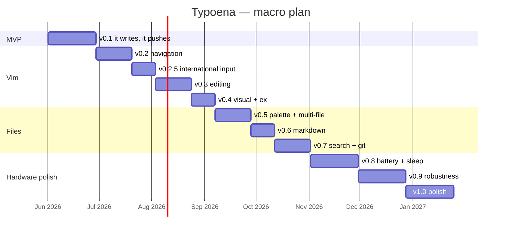

# Typoena

A distraction-free, hackable, DIY writing machine. ESP32-S3 + e-ink + a real
mechanical keyboard. You write Markdown, you commit, you push. Nothing else
runs on it.

> Status: pre-MVP. Hardware not yet on bench. Bring-up in progress.

How each decision is weighted against the user-facing requirements — and the critical performance budget that falls out — lives in [`docs/qfd.md`](docs/qfd.md). The ontology layers those docs use (WHAT / Function / Characteristic / Metric / Target) are defined in [`GLOSSARY.md`](GLOSSARY.md).

---

## Vision

A single-purpose appliance that boots into a text editor with a Vim keymap,
edits Markdown files, and (optionally) pushes them to a git remote (GitHub
first) over Wi-Fi. No browser, no notifications, no apps. Open lid → write →
push (or don't) → close lid.

Two file scopes coexist on the SD card — formal definitions in
[`CONTEXT.md`](CONTEXT.md):

- **Tracked** — lives in the git working copy, gets **Published** when the
  user presses `Ctrl-G`.
- **Local** — never leaves the device. Permanently-private: journal entries,
  scratch, things that aren't anyone else's business. There is no "promote
  to Tracked" gesture — scope is fixed at file creation.

Same editor, same keymap; the difference is just whether `Ctrl-G` (publish to
the remote) is offered.

---

## Hardware

| Part      | Choice                                                        | Why                                                                                                                                                                                                                                                                                                                     |
| --------- | ------------------------------------------------------------- | ----------------------------------------------------------------------------------------------------------------------------------------------------------------------------------------------------------------------------------------------------------------------------------------------------------------------- |
| MCU       | **ESP32-S3-N16R8** (16 MB flash, 8 MB octal PSRAM)            | USB OTG host (for the keyboard), Wi-Fi, BLE, dual core @ 240 MHz, plenty of PSRAM for git pack data and screen buffer. Best-supported Rust target in the ESP family.                                                                                                                                                    |
| Display   | **GDEY0579T93 + DESPI-c579 breakout** (5.79", 792×272, 1-bit) | Good Display panel matched with its own FPC breakout. Strip aspect (~2.9:1) — Freewrite-coded: ~13 lines, ~79 cols at the editor's 10px font. Tiny framebuffer (~27 KB) leaves PSRAM headroom. The DESPI-c579 is a passive level-shifter / FPC-to-header board, not an active controller — driven over plain SPI like any other epd. |
| Keyboard  | **Nuphy Air60/Halo65 wired USB-C**                            | ESP32-S3 acts as USB host via TinyUSB. BLE-HID is a fallback but contends with Wi-Fi for radio time during push.                                                                                                                                                                                                        |
| Storage   | microSD over SPI                                              | Holds both the git working copy (`/sd/repo/`) **and** the local-only scratch space (`/sd/local/`). Internal flash is for firmware + config only.                                                                                                                                                                        |
| Power     | **USB-C wall power for MVP**, 18650 + IP5306 in Phase 3       | Measure power profile on real hardware before sizing the battery. E-ink + sleep should give multi-day battery life but battery introduces charging, safety, and BMS complexity we don't need on day one.                                                                                                                |
| Enclosure | 3D-printed, hinged lid                                        | Phase 4 concern.                                                                                                                                                                                                                                                                                                        |

**Why the strip aspect:** the ~2.9:1 long-narrow shape biases the UX
toward "current line + recent context" rather than "full page" — the
writing posture we want. The renderer stays resolution-agnostic so a
10.3" e-ink upgrade (v1.x) is a swap, not a rewrite. Medium choice
(e-ink over LCD / memory LCD / OLED) and panel rationale:
[ADR-003](docs/adr.md#adr-003-display-medium--e-ink-gdey0579t93-panel).

---

## Software stack

**Language: Rust on `esp-idf-rs` (std).** Decision is load-bearing — see the
rejected alternatives below, and [`docs/adr.md`](docs/adr.md) for the full
decision log covering language, UI strategy, display, git lib, auth,
concurrency, storage, power, and keyboard transport. How each decision is
weighted against the user-facing requirements — and the critical performance
budget that falls out — lives in [`docs/qfd.md`](docs/qfd.md). The ontology
layers those docs use (WHAT / Function / Characteristic / Metric / Target)
are defined in [`GLOSSARY.md`](GLOSSARY.md).

| Layer            | Crate / Component                                        | Notes                                                                                                                                                                                                                                              |
| ---------------- | -------------------------------------------------------- | -------------------------------------------------------------------------------------------------------------------------------------------------------------------------------------------------------------------------------------------------- |
| HAL / runtime    | `esp-idf-svc`, `esp-idf-hal`                             | std build, gives us heap, threads, VFS, mbedtls, Wi-Fi stack.                                                                                                                                                                                      |
| Display          | `embedded-graphics` + `epd-waveshare` (or custom driver) | Pixel framebuffer with partial-refresh regions. We track dirty rects ourselves. The GDEY0579T93 uses an SSD1683-class controller; if it's not already in `epd-waveshare`, we write a small driver against `embedded-hal` SPI — ~300 LoC, low risk. |
| Editor core      | Custom, in-tree                                          | Rope buffer (`ropey`), mode state machine, Vim keymap table.                                                                                                                                                                                       |
| TUI-style layout | Custom thin layer (~500 LoC)                             | API inspired by Ratatui (`Layout`, `Block`, `Paragraph`) but renders directly to `embedded-graphics`. See below.                                                                                                                                   |
| USB host         | `esp-idf` TinyUSB bindings                               | Boot-protocol HID is enough for the keyboard.                                                                                                                                                                                                      |
| Git              | `gitoxide` (`gix`)                                       | Pure-Rust, modular. We only need add / commit / push (smart HTTP). No libgit2, no mbedtls glue beyond what `esp-idf` already gives us.                                                                                                             |
| TLS              | `mbedtls` via `esp-idf`                                  | Used for GitHub HTTPS. ~120 KB heap during handshake — fits in PSRAM.                                                                                                                                                                              |
| Auth             | GitHub Personal Access Token in encrypted NVS            | SSH on embedded is painful; HTTPS+PAT is the pragmatic path.                                                                                                                                                                                       |
| Filesystem       | FAT on SD (`esp_vfs_fat`)                                | Working copy lives here. Internal LittleFS holds config.                                                                                                                                                                                           |

### Why not Ratatui

Ratatui assumes a **character-grid terminal** with an ANSI backend. E-ink is a
**pixel framebuffer with partial-refresh windows**. The right primitive for
e-ink is dirty-rectangle tracking aligned to the panel's refresh regions —
Ratatui's per-cell diff model fights this. We can borrow its widget _API
shape_ (it's a good one) without dragging in the terminal abstraction. Net
saving: probably 200 KB of binary and a lot of pretending the screen is a
VT100.

### Why not Gleam + Shore

BEAM doesn't run on ESP32. AtomVM does, but: memory budget is tight, Gleam-on-
AtomVM is bleeding-edge, and there are no bindings for USB host / e-ink / SD /
TLS / git in that ecosystem. Shore is also terminal-oriented, so the same
impedance mismatch as Ratatui applies. Building this on Gleam would be a
research project stacked on a research project. Revisit in 2-3 years.

### Why not C / Arduino

Workable, well-trodden, fastest path to a blinking screen. But this is a
project I want to keep evolving — Rust's refactoring leverage and type safety
pay off the moment we start adding modes, palette, search, etc.

---

## UX boundaries set by the medium

E-ink is a brutal honesty filter on UI choices. Hard constraints we design
around, not against:

- **No cursor blink.** Kills the panel and the battery.
- **Typing latency target: ≤ 200 ms** from keypress to glyph on screen, using
  partial refresh on the affected line only.
- **Full refresh every ~20 partials** to clear ghosting. User-visible flash —
  schedule it on pauses (>1 s of no input).
- **No smooth scrolling.** Page-style jumps only.
- **No animations.** Anywhere.
- **Render only changed lines**, not the viewport.

---

## Roadmap

Frequent releases. Each version is a usable artifact, not a checkpoint.
Macro-plan below; per-version scope lives in [`docs/roadmap.md`](docs/roadmap.md).



| Version                                                 | Theme        | One-liner                                  |
| ------------------------------------------------------- | ------------ | ------------------------------------------ |
| [v0.1](docs/roadmap.md#v01--mvp-it-writes-it-pushes--)  | MVP          | Boots, edits one file, `Ctrl-G` pushes.    |
| [v0.2](docs/roadmap.md#v02--vim-navigation--)           | Vim nav      | Normal/Insert, motions, line numbers.      |
| [v0.2.5](docs/roadmap.md#v025--international-input--)    | Intl input   | US-Intl dead keys: à é ê ç, `'`+space = `'`. |
| [v0.3](docs/roadmap.md#v03--vim-editing--)              | Vim edit     | `dd yy p`, undo/redo, counts.              |
| [v0.4](docs/roadmap.md#v04--visual-mode--ex-commands--) | Visual + ex  | `v V`, `:w :q :e` command line.           |
| [v0.5](docs/roadmap.md#v05--file-palette--multi-file--) | Files        | `Ctrl-P` over `/repo` + `/local`, buffers. |
| [v0.6](docs/roadmap.md#v06--markdown-affordances--)     | Markdown     | Headings, list continuation, soft-wrap.    |
| [v0.7](docs/roadmap.md#v07--search--better-git--)       | Search + git | `/`, `:Gpull`, `:Gbranch`.                 |
| [v0.8](docs/roadmap.md#v08--power-battery--sleep--)     | Power        | 18650 + sleep + lid switch.                |
| [v0.9](docs/roadmap.md#v09--robustness--)               | Robustness   | Crash-safe writes, reconnect, settings.    |
| [v1.0](docs/roadmap.md#v10--polish--)                   | Polish       | Boot ≤ 3 s, fonts, enclosure, guide.       |
| [v1.x](docs/roadmap.md#v1x--stretch--nice-to-have)      | Stretch      | 10.3" panel, spell-check, themes, BLE.     |

---

## Repo layout (planned)

```
/firmware       Rust crate, esp-idf-rs target
                (SD card mounted at runtime contains /repo and /local)
  /src
    editor/     rope buffer, modes, keymap
    render/     embedded-graphics + dirty rects
    git/        gitoxide wrapper, auth
    usb/        TinyUSB host glue
    fs/         SD + NVS
  build.rs      reads TW_* env vars (Wi-Fi, PAT, author) — v0.1 config path
  sdkconfig.defaults
/hardware       BOM, schematic, enclosure (later)
/docs           ADRs, QFD, roadmap, per-version product + technical specs,
                rendering/UX spike log (spikes.md)
CONTEXT.md      project glossary — Tracked / Local / Save / Publish, and the
                principles that fall out of them
GLOSSARY.md     methodology glossary — the WHAT / Function / Characteristic /
                Metric / Target ontology layers used across docs
package.json    pnpm + oxfmt — formatting toolchain for docs/JSON
                (companions: pnpm-lock.yaml, .oxfmtrc.json, .node-version)
```

---

## Open questions / risks (tracked, not yet resolved)

- [ ] `gix-clone` + `gix-pack` smart-HTTP push working on `esp-idf-rs` with
      mbedtls — needs an early spike before locking the stack.
- [ ] TinyUSB host stability with arbitrary HID descriptors (Nuphy reports
      consumer-control keys we may need to ignore).
- [ ] Heap fragmentation over a long writing session with PSRAM allocator.
- [ ] Real-world e-ink ghosting with current partial-refresh cadence.

These get resolved by writing code, not by deciding harder.
