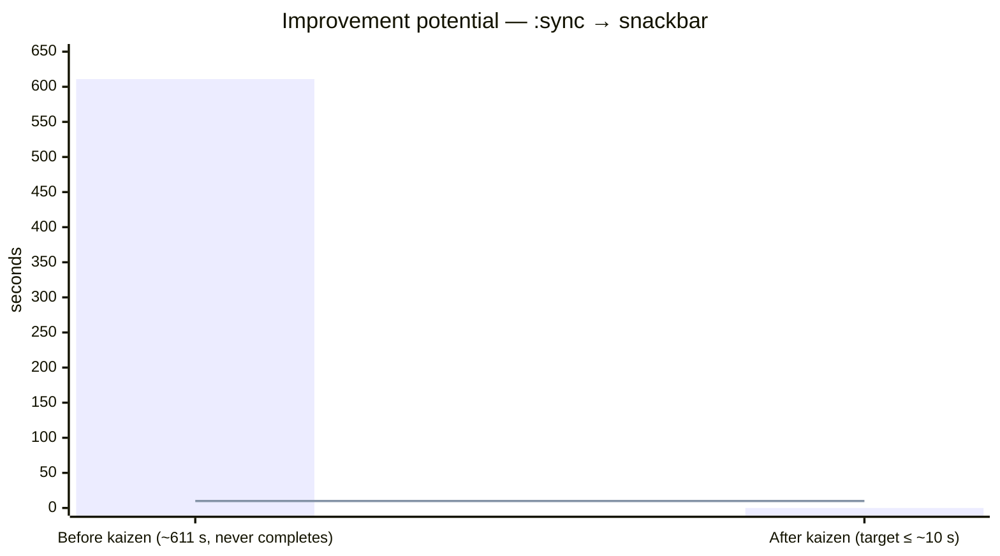

# Kaizen — `:sync` never completes on the real notes repo

The writer presses `:sync` on the Typoena appliance and the device freezes for
ten minutes; a power-cycle re-enters the same freeze forever. The real
`jcalixte/notes` clone (1179 files, 263 MB pack) has never been synced from the
device — only the toy test repo has. Full measurement trail:
[`../tradeoff-curves/sync-commit-staging.md`](../tradeoff-curves/sync-commit-staging.md).

## 1) Improvement potential

**Value model for the writer (Julien on the appliance)**

| Want more of | Do less of |
|---|---|
| + words safely on the remote with one keystroke | – waiting on a frozen device |
| + trust that `:sync` completes, every time | – power-cycling mid-sync and losing the session's trust |
| + keep writing while it publishes | – babysitting git from a desktop to rescue the card |

**Measurement**: seconds from `:sync` to the snackbar, on the real
`jcalixte/notes` clone on the device.



The before bar understates the reality: a reset re-enters the freeze, so the
true value is ∞ — 0 successful syncs ever. The line is the ≤ ~10 s target; the
after column has no bar until the step-6 measurement lands.

## 2) Current method analysis

```
:sync (current method, real repo)
        │
        ▼
┌─ local commit ────────────────────────────────────┐   ┌─ network push ──────┐
│ stage: add_all(["*"]) + update_all(["*"])         │   │ TLS + push          │
│   → stat()s 1179 files / 158 dirs over 10 MHz SPI │──▶│ ~6.5 s floor        │
│ index.write ⚡ ~611 s                             │   │ (separate curve)    │
│   → FAT's 2 s mtime marks ~every entry "racy"     │   └─────────────────────┘
│     → re-hashes ~170 MB (150 MB of images)        │
│ write_tree + commit-obj ⚡ seconds each           │
│   → loose writes trigger pack reads through        │
│     emulated mmap; each far lseek walks the        │
│     FAT cluster chain (~190 ms)                    │
└────────────────────────────────────────────────────┘
   ⚡ = weak points, measured on device
```

Every factor was benched on the device (`sd_bench` for raw FAT, `git_bench` for
git2 primitives on the real clone) — details and full tables in
[`../tradeoff-curves/sync-commit-staging.md`](../tradeoff-curves/sync-commit-staging.md):

| Factor # | Factor | Hypothesis | Test method | Test result | True or false? |
|---|---|---|---|---|---|
| 1 | SD card raw I/O | The card itself is slow: a loose-object write costs ~700–900 ms | `sd_bench`: raw FAT create/write/rename composite, same card, same 10 MHz | complete loose-object composite **86 ms** — 8× under libgit2's number | **FALSE** |
| 2 | `index.write()` racy-clean | FAT's 2 s mtime granularity makes ~all 1179 entries look racy → full ~170 MB re-hash over SPI | `git_bench` on the real clone, 3 consecutive `index.write()` | **611 s → 12.8 s → 360 ms** — the decay is the racy set shrinking as the index mtime advances | **TRUE** |
| 3 | Index-free alternative | Skipping `index.write` (fresh in-memory index) escapes the wall | `git_bench`: `Index::new` + `read_tree(HEAD)` + `write_tree_to` | seed `read_tree` **77 s cold** + mmap grows to 7.4 MB → **zlib OOM crash** — still O(N_tree) | **FALSE** (as a fix) |
| 4 | FatFS `lseek` | Long/backward seeks walk the FAT cluster chain over SPI (~67 KB of FAT reads for a 263 MB file) | `sd_bench`: seek+read 4 KB @offset 0 vs @end of the pack; A/B with `CONFIG_FATFS_USE_FASTSEEK` | @0 = 5.8 ms, @end = **198.7 ms**; fast-seek → **20.4 ms** | **TRUE** |
| 5 | Free-cluster scan | A ~740 MB-full card slows FAT allocation | `sd_bench` re-run on the full card | composite 77 ms — unchanged | **FALSE** |
| 6 | Strict object creation | OID validation on commit/treebuilder causes the ~1.3 s commit premium | strict-off A/B in `git_bench` | 1.80 s vs 1.93 s — no premium removed | **FALSE** |
| 7 | Repeated small mmap windows | A window cache in `esp_map.c` would absorb the ~8 small pack reads per loose write | instrumented cache (v2), 4 real-repo runs | **0 hits / 313 misses** — every read hits a unique (offset, len); `mwindow` already absorbs true repetition | **FALSE** |
| 8 | Cache memory discipline | The OOM in factor 3 is our own cache holding buffers past `p_munmap`, defeating `MWINDOW_MAPPED_LIMIT` | run-4 memory monitor after evict-on-munmap fix, then full removal (run 5) | resident flat at 1833 KB, heap ≥ 6.2 MB, no OOM; removal I/O-neutral | **TRUE** |

### Details on hypothesis #2 (the freeze itself)

`git_index_write` unconditionally runs `truncate_racily_clean`, which re-hashes
every entry whose mtime is not strictly older than the index stamp. On a fresh
FAT clone the 2 s mtime granularity makes the whole tree racy, so a one-line
note edit re-hashes ~170 MB — mostly the ~260 images a text edit never touches —
over the 10 MHz SPI bus. This is why the device freezes ~10 minutes and why a
reset never helps: the index mtime doesn't advance, so it re-hashes forever.

**Selected weak point**: the local commit stage — its staging strategy is
O(N_tree) in files and bytes, on a device where N_tree ≈ 1179 and the bus is
10 MHz SPI. (The ~6.5 s network half is real but is a separate curve,
[`../notes/sync-latency.md`](../notes/sync-latency.md), and it does not brick
the device.)

## 3) Ideas

### Bibliography

- [FatFS `f_lseek` docs (elm-chan.org)](http://elm-chan.org/fsw/ff/doc/lseek.html) — the cluster-chain walk and the CLMT fast-seek mechanism.
- [ESP-IDF FatFS docs](https://docs.espressif.com/projects/esp-idf/en/latest/esp32/api-reference/storage/fatfs.html) — `CONFIG_FATFS_USE_FASTSEEK`, recommended for read-heavy workloads with long backward seeks.
- Vendored libgit2 v1.9.4 source — `index.c` `truncate_racily_clean` (the re-hash wall), `odb.c` `git_odb__freshen`/`git_odb_refresh` (the per-write pack probes), `mwindow.c` (32-bit defaults: 32 MB window / 256 MB mapped limit).

### New ideas

| Name | Estimated gain | Estimated lead time | Cause addressed | Comments |
|---|---|---|---|---|
| **O(depth) TreeBuilder splice** — patch only the edited path's ancestor chain onto HEAD's tree | commit 611 s → ~2–3 s; **flat in repo size forever** | ~2 days (bench op, then plumbing) | #2 + #3 — never opens the index, never materialises the tree | **Chosen.** Bonus: carries the 150 MB of images forward by OID, so the device doesn't even need them in its working tree |
| `CONFIG_FATFS_USE_FASTSEEK` + 256-word CLMT buffer | 2.3× on the splice (6.5 → 2.8 s); far seek 198.7 → 20.4 ms | hours — config, not code | #4 | Shipped as the companion fix; write-mode files fall back transparently |
| Explicit-path index staging (`add_path` over the editor's dirty set) | removes the O(N) walk term only | ~1 day | #2 partially | Retired — still calls `index.write()`, so it hits the same racy-clean wall |
| Index-free `write_tree_to` on a fresh in-memory index | — | ~1 day | #2 | Refuted by factor 3: seeding `read_tree(HEAD)` is 77 s + OOM — trades one O(N) for another |
| `esp_map.c` window cache (v2: size-keyed admission, evict-on-munmap) | hoped ~150–250 ms per loose write | ~1 day | #7 | Built and instrumented → **0 hits in 4 runs** → removed entirely. The one build made on an unverified cause; see learnings |
| Faster card / SD at 20 MHz | none for the commit | PCB respin budget | #1 | Rejected — factor 1 refuted; the card was exonerated twice (86 ms then 77 ms composites) |
| Shrink the repo (images off-card / LFS-style pointers) | shrinks N and the 570 MB clone | unknown | N itself | Rejected for now — the images are load-bearing for another app ([`../notes/git-sync-images-and-repo-size.md`](../notes/git-sync-images-and-repo-size.md)). Composes with the splice later |

**Chosen idea**: the O(depth) TreeBuilder splice, with fast-seek as its config
companion — it is the only candidate whose cost is independent of repo size, so
the problem cannot come back as the notes tree grows. Everything index-shaped
stays O(N_tree) and merely moves the wall.

## 4) Test plan

**What could go wrong?**

| Lens | Anticipated consequence | Mitigation |
|---|---|---|
| Stable | libgit2's 32-bit mwindow defaults `malloc` a 32 MB window on first pack access → instant OOM on the 8 MB PSRAM heap | `GIT_OPT_SET_MWINDOW_SIZE` 256 KB / `MAPPED_LIMIT` 4 MB set at service start, before any `Repository::open` |
| Stable | Power pull between a save and the next `:sync` loses the dirty set — nothing walks the tree anymore, so an unrecorded file would **never** sync | Dirty set journaled to `/sd/.typoena-dirty` (atomic write), recorded *before* the file write; over-reporting is a free no-op splice, so the semantics stay simple |
| Stable | Commit lands, push fails → the commit strands forever behind "up to date" | Stranded-commit recovery: compare HEAD against `refs/remotes/origin/<branch>` and push even when there is nothing new to commit |
| Method | Reconcile's `Mixed` reset writes the index → re-enters the racy-clean wall through the back door | `ResetType::Soft` — ref move only; there is no index to reset anymore |
| Method | **Deliberate behavior change:** files edited on the card from a desktop are never committed anymore (`add_all` used to sweep them in) | Accepted and documented as intent — the appliance's editor is the only writer that counts |
| Machine | libgit2 holds the pack + `.idx` descriptors open and opens loose objects on top → blows the editor's 4-FD mount | git builds mount with 16 FDs (`Storage::mount_for_git()`) |

The mechanism was stress-tested as a prototype first, never in production: the
splice ran as a `git_bench` op against a full real-repo clone through four
localization rounds before any firmware plumbing.

**Who must we convince?**

- Upstream libgit2 maintainers — the tlsf double-free in the mbedTLS stream
  error path (found during rollout; `wrap`'s error path frees the caller's
  socket stream, `new()` frees it again). Needs an upstream report; we ship a
  whole-file override meanwhile.
- Desktop-me (and any future contributor) — the card's working tree now shows a
  permanent diff against HEAD when inspected on a Mac. That is intent, not a
  bug.

**Rollback**: the `git` feature flag gates the whole sync stack (the light
build never links it), and the plumbing is a small commit range to revert. The
journal file is additive — an old build simply ignores it.

**Measurement protocol for step 6**: full `:sync` on the device against the
real clone — `commit split —` log lines plus snackbar-to-snackbar wall time,
cold and steady-state.

## 5) Implementation

**Before** — `stage_and_commit` walked and hashed the world through the index
(condensed; `firmware/src/git_sync.rs` at `a5edaed~1`):

```rust
fn stage_and_commit(repo: &Repository) -> Result<Option<Oid>> {
    let mut index = repo.index()?;
    index.add_all(["*"], IndexAddOption::DEFAULT, Some(&mut skip_macos_cruft))?;
    index.update_all(["*"], Some(&mut skip_macos_cruft))?;  // stat 1179 files
    index.write()?;                    // ⚡ racy-clean re-hash: ~611 s on FAT
    let tree = repo.find_tree(index.write_tree()?)?;
    // … commit(Some("HEAD"), …, &tree, &parents)
}
```

**After** — the editor's journaled dirty paths are spliced onto HEAD's tree;
the index never exists (condensed; `firmware/src/git_sync.rs:345`):

```rust
fn stage_and_commit(repo: &Repository, paths: &BTreeSet<String>) -> Result<Option<Oid>> {
    let parent = repo.head().ok().and_then(|h| h.peel_to_commit().ok());
    let mut tree = parent.as_ref().map(|c| c.tree()).transpose()?;
    for path in paths {
        let blob = match fs::read(format!("{REPO_DIR}/{path}")) {
            Ok(bytes) => Some(repo.blob(&bytes)?),       // present → splice in
            Err(e) if e.kind() == NotFound => None,      // deleted → splice out
            Err(e) => return Err(e.into()),
        };
        let spliced = splice(repo, tree.as_ref(), &parts(path), blob)?;
        tree = Some(repo.find_tree(spliced)?);
    }
    // … same "tree unchanged → nothing to publish" check, same commit call
}

/// Reads ~depth tree objects, writes ~depth new ones; every sibling entry is
/// carried by OID — never opened.
fn splice(repo: &Repository, base: Option<&Tree>, path: &[&str], blob: Option<Oid>) -> Result<Oid>
```

The same pipeline, redrawn with the change applied:

```
:sync (new method, real repo)
        │
        ▼
┌─ local commit ────────────────────────────────────┐   ┌─ network push ──────┐
│ splice: for each journaled dirty path (≈1)        │   │ TLS + push          │
│   read file → blob → rebuild its ancestor         │──▶│ ~6.5 s floor        │
│   subtree chain (~depth tree objects)             │   │ (untouched — next   │
│ commit-obj                                        │   │  curve to attack)   │
│ no index · no walk · no re-hash · images          │   └─────────────────────┘
│ carried by OID · lseek O(1) via fast-seek         │
└────────────────────────────────────────────────────┘
```

Around the mechanism, the plumbing that makes it safe day-to-day: the
`/sd/.typoena-dirty` journal with its pending → in-flight → settled lifecycle,
stranded-commit recovery, a radio-free "up to date" answer (~150 ms instead of
a Wi-Fi/TLS round), soft-reset reconcile, the 16-FD git mount, and the mwindow
options at service start. Details:
[the fix — wiring](../tradeoff-curves/sync-commit-staging.md#the-fix--wiring-the-odepth-splice-into-the-firmware).

## 6) Evaluation

**Measurement redone** (seconds, `:sync` → snackbar on the real repo):
∞ (never completed) → **PENDING end-to-end** (target was ≤ ~10 s).

What is measured so far, on device against the real clone (2026-07-13):

- The commit half works for the first time ever: splice **4.2 s** + commit-obj
  **3.2 s** with the UI running concurrently (commits `a73bca0e`, then
  `8939168f` carrying a 2-path journal across a power cycle).
- Projected full cold `:sync` ≈ **9–10 s** (commit + the ~6.5 s network half).
- The push half is not yet verified: the first attempt hit the card's
  SSH-shaped origin (now rewritten to HTTPS at load), the second a tlsf
  double-free in libgit2's mbedTLS stream error path (fixed via the
  `esp_mbedtls_stream.c` override + `CONFIG_MBEDTLS_EXTERNAL_MEM_ALLOC=y`).
  The step-1 number lands when the next on-device `:sync` completes
  snackbar-to-snackbar — protocol in step 4.

**Learnings**:

- **Bench the real thing.** The toy repo understated everything by ~2 orders
  of magnitude; "works on the toy" hid a total brick. The real clone is now
  the only valid bench target.
- **Refute before building.** Four theories died to measurement (card speed,
  free-cluster scan, strict creation, repeated windows). The one build made on
  an unverified cause — the `esp_map.c` window cache — was the one wasted
  build: 0 hits in 4 instrumented runs, removed entirely.
- **FAT breaks POSIX assumptions.** 2 s mtime granularity, no inode,
  cluster-chain seeks: any POSIX-shaped library (libgit2's racy-clean check,
  the mmap emulation) needs its cost model audited on FAT before trusting it.
- **Prefer mechanisms flat in N.** The splice cannot regress as the notes tree
  grows — the fix that prevents the problem from ever coming back, which is
  the kind kaizen prefers.

**Standard to update**:

- Bench and verify against the **real repo clone**, never the toy (the toy is
  ~2 orders of magnitude too kind) — recorded in the tradeoff doc's
  [how to bench](../tradeoff-curves/sync-commit-staging.md#how-to-bench--flash).
- Any new libgit2 entry point **must set the mwindow options before its first
  `Repository::open`** — the 32-bit defaults OOM the 8 MB heap (done in
  `git_sync` and `git_bench`; the rule is the standard).
- `CONFIG_FATFS_USE_FASTSEEK=y` + 256-word CLMT buffer stay pinned in
  `sdkconfig.defaults`.

**Share with**:

- Upstream libgit2 — file the tlsf double-free report (mbedTLS stream error
  path: `wrap`'s error path frees the caller's socket stream, `new()` frees it
  again; v1.9.4).
- A write-up for the notes/blog — the four-round localization story (611 s →
  ~2.8 s commit on a microcontroller, four theories refuted on the way) stands
  on its own.

**Next steps**

- Run the end-to-end on-device `:sync` verify and close the step-1
  measurement (the stranded `8939168f` should push first).
- File the libgit2 upstream bug report.
- Instrument the residual ~360 ms/loose-write (suspect: FAT directory-op cost
  in the freshen/refresh path) — one `sd_bench` + `p_mmap`-miss logging pass.
- Measure the ref/reflog leg of the shipping commit (the bench's
  `commit(None)` writes no ref).
- Attack the next curve: the ~6.5 s network floor
  ([`../notes/sync-latency.md`](../notes/sync-latency.md)); the
  images-off-card lever
  ([`../notes/git-sync-images-and-repo-size.md`](../notes/git-sync-images-and-repo-size.md))
  composes with the splice.
