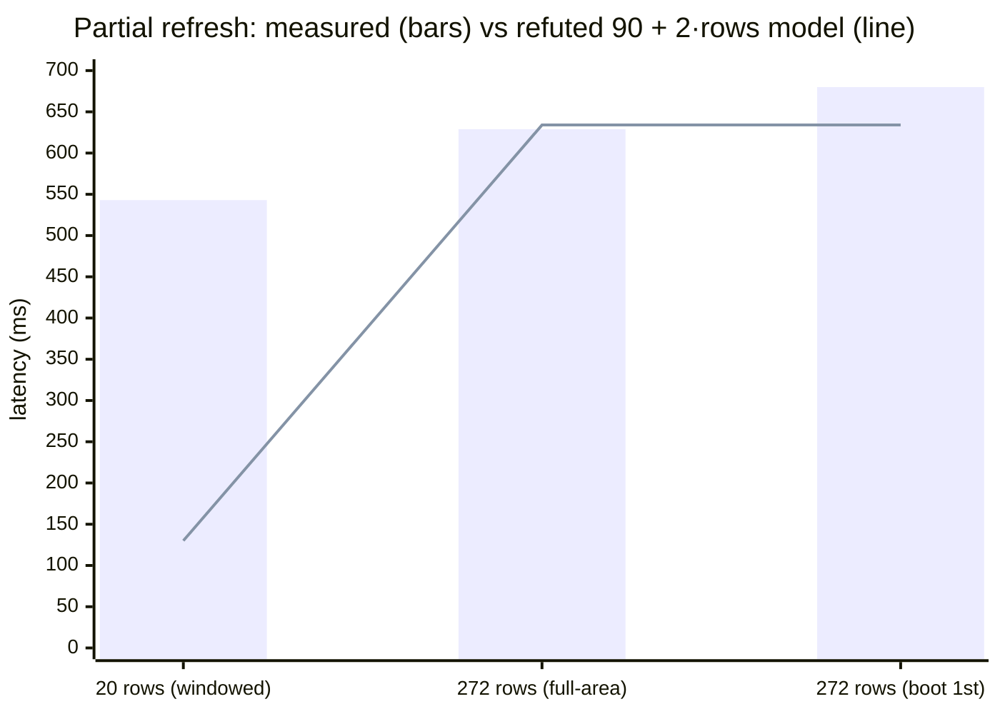
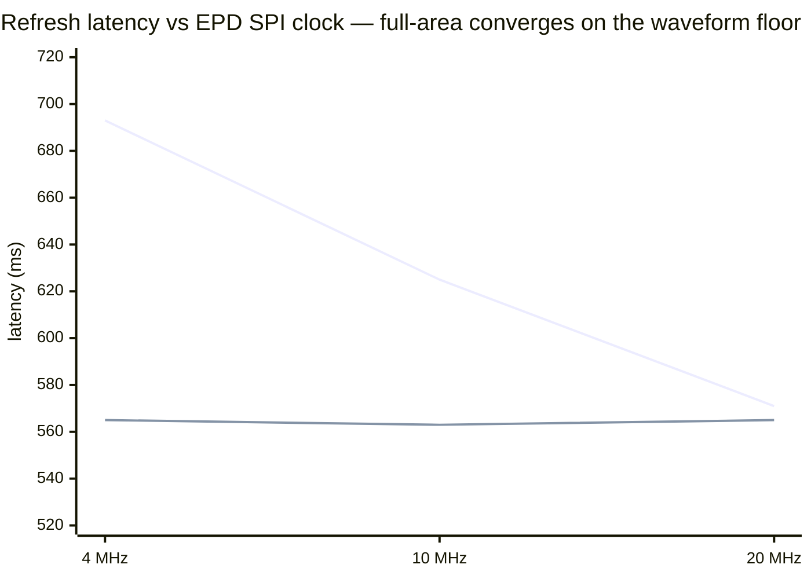
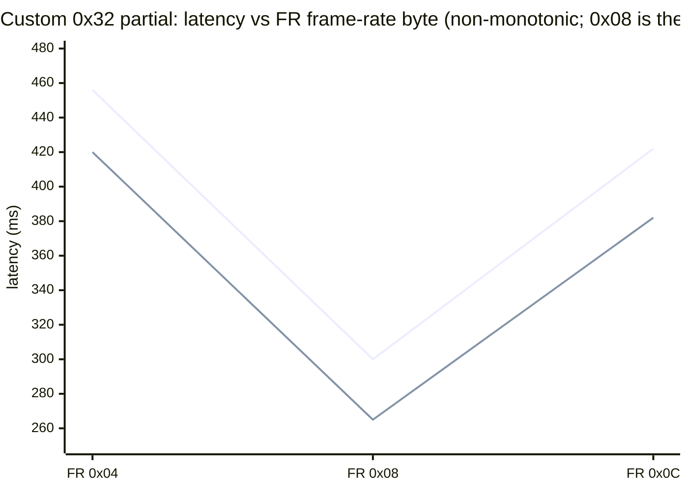

# E-ink refresh latency vs rows driven

> **Model (corrected 2026-07-16):** on this GDEY0579T93 (SSD1683 dual-controller)
> panel, refresh time is set by **which waveform LUT runs** — full-clear
> (~1870 ms) or partial (~540 ms floor) — plus a small SPI-transfer term that
> scales with the rows written (~0.34 ms/row at 4 MHz). Rows driven do **not**
> shorten the waveform itself: the gate-scan spike refuted MUX-proportional
> timing
> ([postmortem](../postmortems/2026-07-16-gate-scan-spike-refuted.md)), killing
> this doc's original `90 ms + 2 ms · rows` model. This is the cost model behind
> per-keystroke typing, the boot splash→editor swap
> ([`../notes/boot-time-budget.md`](../notes/boot-time-budget.md)), and the
> scroll/gutter spikes.
>
> Tradeoff-curves index: [`README.md`](README.md). Docs index:
> [`../README.md`](../README.md). QFD budget (§6, H1/H4 rows):
> [`../qfd-budget.md`](../qfd-budget.md#6-critical-performance-budget). Driver:
> [`../../firmware/src/epd.rs`](../../firmware/src/epd.rs). Bench origin:
> Spikes 5 + 8 ([`../spikes.md`](../spikes.md)); measured points from the
> 2026-07-16
> [bank-toggle](../postmortems/2026-07-16-partial-refresh-bank-toggle.md) and
> [gate-scan](../postmortems/2026-07-16-gate-scan-spike-refuted.md) sessions.

## The model

A refresh is three serial costs:

```
set RAM window  →  clock the pixels out over SPI  →  run the update waveform
   (fixed)          (scales with bytes = rows:         (fixed per LUT tier —
                     3 band writes at 4 MHz)            does NOT scale with rows)
```

- **The LUT sets the tier — and the floor.** A _partial_ update (`0x22`←`0xFF`)
  plays a short phase schedule that only nudges pixels that changed; a _full_
  update (`0x22`←`0xD7`, the fast-full LUT) plays ~3× as many frames to fully
  clear-and-set — slower, but it erases ghosting and re-establishes a known
  image. BUSY ends when the phase schedule ends, **however many gates were
  driven** — refresh duration lives in the LUT, not the scan.
- **Row count only trims the SPI transfer.** Each partial writes the band three
  times (`0x24` before the waveform, `0x26`+`0x24` resync after — see the
  [bank-toggle postmortem](../postmortems/2026-07-16-partial-refresh-bank-toggle.md)),
  so a full-area partial moves ~41 KB at 4 MHz (~86 ms) where a one-line band
  moves ~3 KB (~6 ms). That transfer is the *entire* difference between
  windowed and full-area.
- **Column width (X) is free to keep full.** The panel is a master (`0x00`) +
  slave (`0x80`) pair with the framebuffer split at the seam; every refresh
  drives _both_ controllers full width so the seam/mirror math stays intact
  (`update_part` / `write_frame_bank` in
  [`epd.rs`](../../firmware/src/epd.rs)).

Fitted through the two measured partial points:

```
t_partial(rows) ≈ 536 ms + 0.34 ms · rows
                  └ LUT waveform ┘  └ SPI: 3 band writes at 4 MHz ┘
```

Full refresh sits in its own flat tier (~1870 ms, full-clear LUT) and cannot be
windowed — the clear waveform needs the whole panel.

## The points

All measured on-device via the per-refresh log
(`{mode} refresh #N … {ms} ms` in [`main.rs`](../../firmware/src/main.rs)):



Bars are the measured partials; the line is what the old linear model
predicted. At 272 rows the two agree within 5 ms — that's where the model was
calibrated, which is how it survived until the first windowed bench. The
20-row point (543 ms measured vs ~130 ms predicted) is the refutation.

| Point                       | Rows |     Latency | LUT        | Source                                                                                       |
| --------------------------- | ---: | ----------: | ---------- | -------------------------------------------------------------------------------------------- |
| Windowed one-line band      |   20 |  **543 ms** | partial    | [bank-toggle session](../postmortems/2026-07-16-partial-refresh-bank-toggle.md)              |
| Full-area partial           |  272 |  **629 ms** | partial    | same session (630 ms in Spike 5)                                                             |
| Full-area partial, at boot  |  272 |  **680 ms** | partial    | boot log (splash→editor swap)                                                                |
| Full refresh                |  272 | **1870 ms** | full-clear | Spikes 5 + 8                                                                                 |
| ~~Spike: 20-gate MUX scan~~ |   20 |      571 ms | partial    | [gate-scan spike](../postmortems/2026-07-16-gate-scan-spike-refuted.md) — reverted, hazard   |
| ~~Spike: 272-gate trim~~    |  272 |      690 ms | partial    | same spike — even the "free" 272-vs-300 trim bought nothing                                  |

## Two things that bound it

**Ghosting caps the partial streak.** Partial updates leave faint residue, so a
full refresh every 64 updates resets clarity and panel state. You can't "always
partial" — the ~1870 ms tier is a periodic tax paid for longevity, not a mode you
can retire.

**The first cold-boot image must be a full refresh.** After power-on the `0x26`
"previous" bank holds garbage, and a partial refresh _diffs against it_ — so the
very first clean paint has to be the full tier. This is why boot pays exactly one
unavoidable ~1.9 s full refresh, and why the splash (which rides it) is nearly
free while the _editor's_ first frame can be a cheap partial on top. Full
derivation: [`../notes/boot-time-budget.md`](../notes/boot-time-budget.md).

## What it decides

- **Per-keystroke typing → ~545 ms per batch, whatever the window.** Additive
  Insert edits still take the windowed band (it's the cheapest mode and skips
  ~80 ms of SPI), but the flat waveform means typing feel is set by the LUT
  floor, not by how little changed. Type-ahead absorbs keystrokes during the
  refresh, so this is per *batch*, not per key.
- **The clean-erase policy is nearly free.** Deletes, caret moves, mode flips,
  and the snackbar take the full-area partial to avoid windowed erase ghosts —
  under the old model a ~500 ms penalty, under the real one ~86 ms of SPI.
- **Boot splash→editor → full-area partial (~680 ms), not a second full refresh
  (~1870 ms).** The splash already seeded the baseline, so the editor rides in
  on a partial — the ~1.2 s cold-boot win recorded in the boot-time budget.
- **Splash + periodic → full refresh.** The unavoidable first image and the
  every-64 de-ghost.

## Levers on the ~540 ms floor

Candidates, ranked by expected payoff against risk. Results tracked in the log
below — this table is the standing menu; the log records what each flash showed.

| Lever                                | Touches waveform? | Moves *perceived* per-stroke latency? | Risk                                                          | Status                                    |
| ------------------------------------ | ----------------- | ------------- | ------------------------------------------------------------ | ----------------------------------------- |
| Custom partial LUT via `0x32`        | **yes — authored** | **Yes — the only lever that does.** ~100–200 ms reported on similar panels | ghosting, DC balance/longevity, cold-temperature margin (reference waveform now obtained) | **validated 2026-07-21 — 495→266 ms windowed via real vendor `LUT_DATA_part` + FR `0x08`; see FR sweep below** |
| Charge-pump keep-hot (`0xCC` vs `0xCF`) | no — trigger + power state | **none measured** — the ramp it skips isn't a real slice of the ~240 ms (first partial after power-down ≈ mid-burst) | pump draws while typing; holding the ±15 V rails is a mild longevity/thermal tax; register writes while powered could glitch bands (none observed) | **tested + reverted 2026-07-21** — toggle kept, `FAST_PART_KEEP_HOT = false` |
| SPI clock 4 → 20 MHz                 | no                | full-area only — measured **−122 ms** (~693→~571 ms, now ≈ windowed); typing flat | signal integrity — 20 MHz clean in test but at panel ceiling on jumpers | **shipped 2026-07-17** — see log            |
| `set_ram_area` settle delay 2 → 0 ms | no                | **yes — the typing path**: windowed **−70 ms** (~565→~495), full-area −44 ms | too-short latch would garble bands / add ghosting — panel clean, user-attested | **shipped 2026-07-17** — `delay_ms(2)` was a whole `vTaskDelay(1)` tick; see log |
| ~~Async partial + deferred bank resync~~ | no — pure firmware | no — frees the editor loop during BUSY, not the eye | bank-toggle ordering (this panel is treacherous — [postmortem](../postmortems/2026-07-16-partial-refresh-bank-toggle.md)) | **closed 2026-07-17** — not worth it post-20 MHz (see below) |
| ~~Temperature-select (`0x1A` sweep)~~ | no | no — flat at every value | — | **closed 2026-07-17** — not a lever (see log) |
| ~~Gate-scan restriction (`0x01`/`0x0F`)~~ | no | — | **refuted + hazard**: MUX-independent timing, mirrors the panel (OTP gate config, write-only) | closed — never write these registers      |

### Async partial — CLOSED 2026-07-17, not worth building

Pitched as a responsiveness win; working the timing through, it isn't — writing
down why so we don't chase it a third time.

Per-stroke *perceived* latency is `write 0x24 band` + `BUSY waveform` — the point
where the ink has physically formed. The `0x26` + `0x24` resync writes async
would defer run **after the ink is already on the panel**, so they never added to
what the user sees — only to how long the editor loop is held. Async frees the
*loop*, not the *eye*.

Three things closed it, the first two decisively after the SPI bump:

1. **The deferred work is now nearly free.** The resync was ~86 ms full-area at
   4 MHz — worth chasing. At 20 MHz the *entire* full-area SPI excess is ~6 ms,
   so there's almost nothing left to move off the path.
2. **The overlap benefit is already handled.** Freeing the loop during BUSY only
   pays if other work can overlap it. Git push (`:gp`) is already on its own
   96 KB thread (non-blocking); SD saves are inline but run in the effect-drain
   step *before* the refresh, not inside the BUSY wait, and idle-saves fire only
   on a typing pause. So the loop rarely has blocking work to hide behind BUSY.
3. **The risk is real.** Async lives in the bank ping-pong that already caused
   the [bank-toggle flapping bug](../postmortems/2026-07-16-partial-refresh-bank-toggle.md)
   — an intermittent, speed-dependent failure class. Poor trade for a few ms.

No observed background-sync stutter to justify it (the decision gate). If that
symptom ever appears, revisit — build it toggleable with a persistent resync
buffer and the resync-before-next-`0x24` invariant enforced in `wait_ready`.

**What's left after this pass:** the only lever on the ~543 ms itself is the
custom `0x32` LUT — parked for its real costs (longevity, ghosting, no reference
waveform), the *sole* per-stroke lever, revisit only if typing latency becomes a
top user complaint. Everything else (temperature, gate-scan, async, SPI beyond
20 MHz) is closed.

### Experiment log — temperature-select sweep

**What it tests.** The partial's `0x22 ← 0xFF` reloads temperature + LUT from the
`0x1A` register on every refresh. `init()` leaves that register at `[0x64, 0x00]`
(~100), so the 543 ms baseline *already* runs at temp 100 — the spike sweeps the
register above and below that to find out whether the partial OTP LUT's schedule
is temperature-indexed the way the fast-full LUT is. Higher = faster would open
the lever; flat across the sweep proves the floor is fixed and closes it.

**How to run.** Set `PARTIAL_TEMP` in [`epd.rs`](../../firmware/src/epd.rs),
flash, type, read `windowed refresh #N … {ms} ms` from the serial log. Note
ghosting over a full ~64-partial streak (shorter drive shadows sooner), not just
the first refresh. `[0x64, 0x00]` reproduces the baseline as a control.

| `0x1A` value  | Windowed (20-row) ms | Full-area (272) ms | Ghosting over 64-streak | Verdict | Date |
| ------------- | -------------------: | -----------------: | ----------------------- | ------- | ---- |
| `[0x64,0x00]` (baseline, init default) | 543 | 629 | clean (current shipping) | control | 2026-07-16 |
| `[0x7F,0x00]` (hotter) | 562–571 | 693 | not evaluated (no gain to justify) | **no gain** — flat vs baseline | 2026-07-17 |
| `[0x19,0x00]` (cold ~25) | 562–572 | 689–698 | not evaluated | **no gain** — flat vs baseline | 2026-07-17 |

**Verdict: CLOSED — temperature is not a lever.** Hot, cold, and default all land
at ~565 ms windowed / ~690 ms full-area. The partial waveform's BUSY time is
temperature-independent on this panel: either `0x18 ← 0x80` (internal sensor)
overrides the `0x1A` register during load-temperature, or the OTP partial LUT
carries a single fixed phase schedule. Restored `PARTIAL_TEMP = None`.

The deeper takeaway: **the ~543 ms is ink-formation physics set by the partial
LUT, and nothing that selects *among* factory LUTs can move it.** Only authoring
a shorter waveform (`0x32`) touches this number — see the reassessment below.

### Experiment log — SPI clock sweep

**What it tests.** The EPD bus clock (`SpiBusDriver` baudrate in
[`main.rs`](../../firmware/src/main.rs)) sets only the pixel clock-out rate, not
the waveform BUSY time. Raising it trims the pre-kick band write and the resync
writes — a perceived-latency term on the full-area path (~43 ms of write at
4 MHz), a small one on the windowed path (~6 ms). The risk is signal integrity
on the panel wiring at higher clocks: watch for garbled or missing bands.

**How to run.** Set the baudrate, flash, type, read `full-area refresh #N … ms`
(the full-area path shows the largest SPI term) and eyeball the panel for
glitches. Expected full-area floor if SPI vanished entirely ≈ 543 ms waveform +
minimal write.

| EPD SPI clock | Windowed (20-row) ms | Full-area (272) ms | Panel integrity | Verdict | Date |
| ------------- | -------------------: | -----------------: | --------------- | ------- | ---- |
| 4 MHz (canonical baseline) | 543 | 629 | clean | control | 2026-07-16 |
| 4 MHz (same-session ref) | ~565 | ~693 | clean | apples-to-apples ref for the sweep | 2026-07-17 |
| 10 MHz | ~563 | 623–628 | clean | −68 ms full-area vs same-session 4 MHz; windowed flat | 2026-07-17 |
| **20 MHz** | ~565 | 569–574 | clean (short test) | **kept — full-area now ≈ windowed**; −122 ms full-area vs same-session 4 MHz, beat the ~20 ms estimate | 2026-07-17 |



Upper (descending) line = full-area partial (272 rows); lower flat line ≈ 565 ms
= windowed one-line partial (the typing path). Both sit just above the ~543 ms
canonical waveform floor. The curve is the whole story: raising the clock only
drains the SPI term, so the full-area line falls toward the windowed line and
stops — past 20 MHz there's nothing left to drain. **Read the shape, not the
slope:** the x-axis is categorical (mermaid limitation), so 4/10/20 MHz are drawn
evenly spaced though the real gaps are 2.5× then 2×; the diminishing return is
even sharper than the picture suggests.

**Result: 20 MHz kept.** Full-area collapsed to ~571 ms — within ~6 ms of the
windowed typing path (~565 ms), so a full-panel repaint is now essentially
*waveform-bound*: the SPI cost of driving all 272 rows instead of 20 has all but
disappeared. The 10→20 MHz step beat the linear-SPI prediction (~54 ms vs the
~20 ms estimated) — the fixed-delay floor was a smaller share of the residual
than assumed. Panel clean through the test; **caveat: 20 MHz is at the SSD1683
ceiling on jumper wiring**, so intermittent corruption could surface in longer
use. Low blast radius if it does — the RAM buffer is source of truth and a bad
paint self-heals on the next refresh (the `force_full` recovery path) — but if
any ghosting/garbling appears, drop to 10 MHz, which is safely in-spec and still
holds most of the win. **Stop here:** only ~6 ms of SPI excess is left, and
above 20 MHz exceeds panel spec for no meaningful gain.

**Result: 10 MHz kept.** Full-area (erase/caret/scroll/mode-switch) dropped
~693 → ~625 ms, windowed typing stayed ~563 ms — the clock moves the SPI term
and nothing else, exactly as modelled. Panel clean, no glitches.

> **Session variance, read the same-session rows.** The canonical 4 MHz numbers
> (543/629, 2026-07-16) run ~20 ms windowed / ~60 ms full-area faster than the
> 2026-07-17 4 MHz measurements of the *same* firmware — panel warmup / ambient
> drift between sessions. So the SPI win is measured against the same-session
> 4 MHz ref (~693 full-area), not the canonical baseline. Cross-session
> absolute-ms comparisons in this doc carry ±~10 %.

At 20 MHz the full-area path was ~571 ms ≈ the windowed ~565 ms, so the SPI cost
of a full-panel repaint is spent. The remaining non-waveform term was the 8
`FreeRtos::delay_ms(2)` calls in `set_ram_area` — and those turned out to be the
*largest* remaining lever, not a rounding error: at a 10 ms tick, `delay_ms(2)`
rounds up to `vTaskDelay(1)` and blocks to the next tick boundary, so it cost
0–10 ms each, not 2 ms. Removing them (next section) took windowed to ~495 ms and
full-area to ~527 ms. After that, both paths sit within ~1 tick of the ~543 ms
canonical partial waveform — the LUT floor — and there is no cheap lever left
short of authoring a custom `0x32` LUT.

**Power is not a factor in the clock choice.** Dynamic power scales with
frequency (`P ≈ C·V²·f`) but a faster clock finishes in proportionally less
time, so the *energy* to shift the same pixel bytes is ~constant across clock —
higher SPI ≠ more drain. And SPI is a rounding error next to a refresh's real
energy cost, the panel DC-DC pump driving ±15 V through the ~543 ms waveform,
which is set by the LUT and wholly independent of SPI clock. The energy levers
are *fewer/shorter refreshes* (custom LUT frames, lower full-refresh cadence),
not the bus rate; device-level draw is dominated by Wi-Fi/TLS during `:gp` and
the CPU/PSRAM regardless.

### Experiment log — `set_ram_area` settle delay

**What it tests.** `set_ram_area` ends with a `FreeRtos::delay_ms` after latching
the RAM-window address. A single partial refresh calls it 8× (3 `write_frame_bank`
× 2 controllers, plus 2 in `update_part`), on both the windowed and full-area
paths alike — the only non-waveform term that touches the typing path too. GxEPD2
doesn't settle per window write, so it's probably unneeded. Knob: `RAM_SETTLE_MS`
in [`epd.rs`](../../firmware/src/epd.rs).

**The trap: `delay_ms(2)` was never 2 ms.** At `CONFIG_FREERTOS_HZ = 100` the tick
is 10 ms, and `esp-idf-hal`'s `TickType::new_millis` *rounds up*, so `delay_ms(2)`
compiles to `vTaskDelay(1)` — one tick. `vTaskDelay(1)` blocks to the *next tick
boundary*, so from a random phase it sleeps **0–10 ms (avg ~5 ms), not 2 ms**.
Eight of them per refresh is **0–80 ms, ~40 ms average** — which is why removing
them bought far more than the "~16 ms" a literal 2 ms would have.

**How to run.** Set the delay, flash, type, read `windowed refresh #N … ms`;
watch for corrupted/missing bands or new ghosting (a too-short latch would show
as wrong pixels in a band). Sweep 2 → 0.

| `RAM_SETTLE_MS` | Windowed (20-row) ms | Full-area (272) ms | Panel integrity | Verdict | Date |
| ------------- | -------------------: | -----------------: | --------------- | ------- | ---- |
| 2 ms (original) | ~565 | ~571 | clean | control (at 20 MHz SPI) | 2026-07-17 |
| **0 ms** | **~495** | **~527** | log healthy (36 refreshes, tight timings, no error-recovery full refresh) + **panel clean, user-attested** (no missing/garbled bands while typing) | **SHIPPED — −70 ms windowed / −44 ms full-area** | 2026-07-17 |
| _(1 ms if 0 corrupts)_ | not needed | not needed | — | 0 ms was clean | — |

**Result: 0 ms shipped.** Windowed typing ~565 → ~495 ms, full-area ~571 → ~527 ms,
across 36 refreshes with a healthy log (tight timings, no crash, no error-recovery
full refresh) and a **user-attested clean panel** — no missing or garbled bands
while typing. Band corruption (the acute failure mode of a too-short latch) is the
thing the eye catches immediately; cumulative ghosting is subtler but is cleared by
the periodic full refresh (`FULL_REFRESH_EVERY = 64`), with `RAM_SETTLE_MS = 1` (a
full 10 ms tick) as the fallback if it ever creeps up. The drop lands squarely
inside the
8 × `vTaskDelay(1)` = 0–80 ms ceiling the tick math predicts, so the attribution is
sound even though the control is a prior flash (see the session-variance note; a
within-flash A/B would tighten it but the mechanism already brackets the result).
The settle was cargo-cult — an e-ink controller latches its RAM-window address when
the SPI transaction completes; there is nothing to wait for. This stacks on the
20 MHz SPI bump: per-keystroke windowed is now **~495 ms**, essentially the bare
partial waveform.

### Experiment log — custom `0x32` LUT + FR frame-rate sweep

**The lever that finally moved the floor.** Every lever above only drains the
*non-waveform* terms (SPI, settle) and bottoms out at the ~495 ms partial-waveform
floor. The one thing that moves the floor itself is authoring the `0x32` waveform —
parked for a year: we had no reference waveform for this panel and a hand-guessed
one (Waveshare 1.54″) never darkened the ink. Good Display supplied the real
`LUT_DATA_part` on 2026-07-21 (archive `S-GDEY0579T93-FP(LUT)`, kept verbatim in
[`../../firmware/reference/gdey0579t93-fp-lut/`](../../firmware/reference/gdey0579t93-fp-lut/)),
which unblocked it. Gated behind the `fast_partial` pref; only the additive Insert
path (`windowed-fast`) drives it. Driver:
[`../../firmware/src/drivers/screen_epd.rs`](../../firmware/src/drivers/screen_epd.rs).

**Two knobs looked plausible; only one moved the number.**

**1. Phase-row count — a near-noop on the partial.** The waveform is 32 phase-rows
(7 bytes each), ~12 active. Good Display's own fast-full waveform (`LUT_DATA1`)
speeds up by *zeroing whole phase-rows*, so we tried the same on the partial: zero
4 of 12 active rows (commit `f0fa320`). Result: **~430 → ~420 ms, ~2 %.** BUSY time
is *not* proportional to active-phase count here — each phase ≈ 2.5 ms. Phase count
dominates *full* refreshes (many frames — the vendor's 1.5 s "快刷" vs ~2 s full
gap), but the short partial has too few phases for it to matter. Dead lever; the
trim was kept only because it's harmless.

**2. The FR byte (LUT index 224, tail "FR, XON") — the lever.** The frame-rate byte
in the `0x32` tail scales the waveform clock, and it is the first thing to break
below the ~495 ms floor.

| FR byte | Windowed-fast (20-row) ms | Full-area partial (272) ms | Ink | Ghosting | Verdict | Date |
| ------- | ---: | ---: | --- | --- | --- | --- |
| factory OTP partial (`fast_partial` off) | ~495 | ~527 | solid black | clean | shipping baseline | 2026-07-17 |
| `0x04` (vendor `LUT_DATA_part` default) | ~420 | ~456 | solid black | clean | real waveform, but barely faster than factory | 2026-07-21 |
| **`0x08`** | **~265** | **~300** | **solid black** | **none seen** | **KEPT — −155 ms (~37 %) vs 0x04; committed `371bba7`, device-confirmed** | 2026-07-21 |
| `0x0C` | ~382 | ~422 | black | slightly more | **worse** — slower *and* ghostier than 0x08 | 2026-07-21 |



Upper line = full-area partial (272 rows); lower = windowed one-line typing path.
Both dip to a minimum at `0x08` and rise again at `0x0C` — **FR is non-monotonic**,
so it is *not* a linear frame period; the byte's encoding is undocumented by the
vendor, and `0x08` is simply the fastest of the sampled values that still fully
darkens. Do not raise past `0x08` blind. (x-axis categorical, mermaid limitation —
the real values 4/8/12 happen to be evenly spaced, so here the spacing is honest.)

**Why the ink stays solid black while the refresh drops ~37 %** — the
counter-intuitive part, worth stating because it looks like a free lunch. It isn't
*more* drive, it's *less wasted* drive. E-paper ink **saturates**: once every black
particle has reached the surface the pixel is as black as it gets, and extra frames
add nothing but time. The vendor tunes `LUT_DATA_part` conservatively — enough
frames to saturate across cold temperature, humidity, panel spread, and years of
aging. On a warm, fresh bench panel that margin is slack: at `0x04` the ink is fully
black partway through and the controller then clocks frames it doesn't need. `0x08`
runs a faster clock that still lets the ink saturate — same endpoint, the
post-saturation tail removed.

**We are spending the vendor's safety margin, so the caveats are real:**

- **Cold is the risk.** Ink migrates slower when cold; `0x08` that's solid black at
  room temperature may go slightly grey in a cold room where `0x04` still had
  headroom. Sanity-check before relying on it in the cold — this is the leading
  reason it's still opt-in, not shipped on by default.
- **Longevity.** Faster frames stress DC balance more per partial; the periodic full
  refresh (`FULL_REFRESH_EVERY_FAST = 32`, half the normal cadence, reloads the OTP
  waveform) is the reset. Watch ghosting over a long real session, not a short bench.
- **Bonus, not tuned-for.** Once a fast refresh loads the custom LUT into SRAM, the
  factory `0xFF` fallbacks (delete / caret / mode-switch) *reuse* it until the next
  true full refresh — so those dropped too (~456 → ~300 ms at `0x08`).

**How to run.** Edit the FR byte (`FAST_PARTIAL_LUT` index 224) in
[`screen_epd.rs`](../../firmware/src/drivers/screen_epd.rs), `just flash`, set
`fast_partial = true` on the SD `.typoena.toml`, type, read
`windowed-fast refresh #N … ms`. For a window-position-free A/B, compare the factory
fallbacks (labelled `full-area`, same `rows 0..=271`) build-to-build. Confirm the ink
is still solid black and watch ghosting across a full ~32-partial streak, not just
the first refresh.

**Status: `0x08` kept (committed `371bba7`, branch `experiment/fast-partial-lut`,
device-confirmed 2026-07-21).** Per-keystroke windowed typing on the custom LUT is
**~265 ms** — down from the ~495 ms factory partial floor this whole doc was fighting,
and the first lever ever to break below it. Not yet merged to main; longevity soak +
cold check outstanding.

### Charge-pump keep-hot — tested, no win (2026-07-21)

FR trimmed the *waveform* portion of the refresh; the *power-cycle* portion is separate.
Trigger `0xCF` powers the ±15 V charge pump **up** (booster soft-start), runs the
waveform, then powers it **down** — on every keystroke. Keep-hot (`0xCC`, same trigger
minus the disable-analog `0x02` + disable-clock `0x01` bits) leaves the pump energized so
keystrokes 2..N of a burst would skip the ramp. Wired behind `const FAST_PART_KEEP_HOT`
in [`screen_epd.rs`](../../firmware/src/drivers/screen_epd.rs).

**Result: no measurable benefit — reverted.** With it on, windowed-fast held flat at
~240 ms (235–244 ms) across a 40+ partial burst, independent of how many keys each refresh
absorbed. The decisive test is the first partial *after* a power-down full refresh: if the
ramp mattered, it would be slower than mid-burst partials. It wasn't —

| transition (full → windowed) | first windowed after full | mid-burst |
|---|---|---|
| #16 → #17 | 236 ms | 242–243 ms |
| #21 → #22 | 235 ms | 241 ms |
| #30 → #31 | 244 ms | 240 ms |
| #46 → #47 | 244 ms | 240 ms |

First-after-full averaged ~239 ms, mid-burst ~240 ms. **There is no ramp penalty to
skip** — the ~240 ms is waveform BUSY, not charge-pump soft-start, exactly as the FR sweep
implied (and this retires the original "the floor is all charge-pump ramp" guess for
good). The screen stayed clean — no band corruption, no extra streak ghosting — so `0xCC`
is *safe*, just pointless here. Against zero upside, keeping the pump hot costs rail draw
during Insert-mode pauses and would need a real idle power-off before shipping, so
`FAST_PART_KEEP_HOT` is left `false`; the toggle stays wired for a future same-session
A/B. (One loose end: this run read ~240 ms where the committed `0x08` baseline was logged
at ~265 ms — a *cross-run* gap that within-run data can't distinguish from panel-temp /
run-to-run variance, so it's not credited to keep-hot.)

