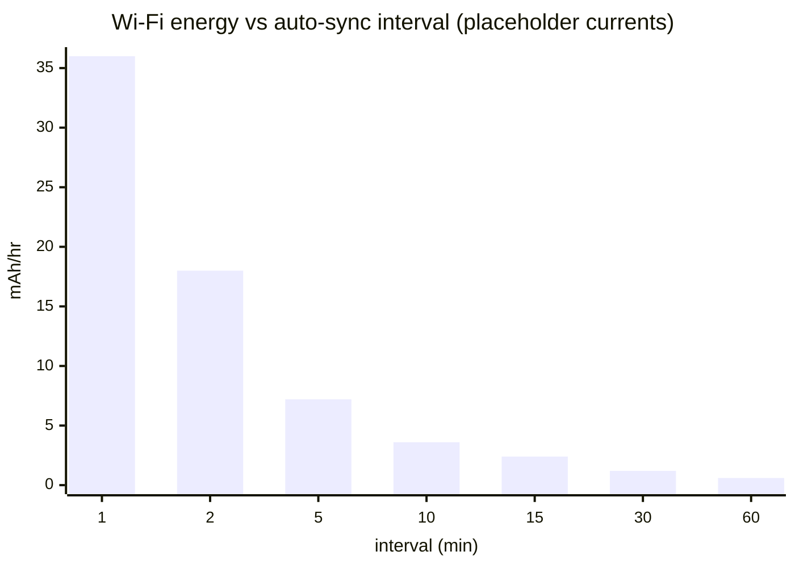

# Wi-Fi energy vs auto-sync interval

> **Decision:** `auto_sync` defaults to **10 min**, and is an *opportunistic,
> rate-limited* push — not a wall-clock timer that wakes the device. See
> [Policy](#policy). Backs the `.typoena.toml` `auto_sync` key in
> [`../macroplan.md`](../macroplan.md) (v0.5). The runtime behaviour was
> pencilled for v0.7, but v0.7 closed 2026-07-14 as search + manual `:gl`/`:gp`
> without it — it is **re-homed to v0.8**
> ([`../v0.8-battery-and-sleep.md`](../v0.8-battery-and-sleep.md)), alongside
> the sleep transitions it must respect and the per-sync radio teardown it
> depends on.
>
> **Revised 2026-07-14** with the first real-device sync measurements (v0.7
> runs on the real ~560 MB notes repo, see
> [`../v0.7-search-and-git.md`](../v0.7-search-and-git.md)): the per-sync
> constant roughly **doubles** and its mix shifts from radio to SD/CPU, but the
> shape, the knee, and the decision all survive — and two v0.7 results make the
> teardown-between-syncs argument *stronger*.
>
> Tradeoff-curves index: [`README.md`](README.md). Docs index:
> [`../README.md`](../README.md).

## The model

For a **text** commit the git payload is a few KB — negligible. The cost of one
sync is (almost) independent of how much you wrote — but it is no longer the
single fixed radio burst the first version of this doc assumed. Measured on
device (v0.7 run 4, 2026-07-14, warm clean `:gp` on the real notes repo):

```
splice commit (SD/CPU, radio not needed)   10.3 s   O(depth) loose writes × ~0.4 s FAT dir scan
push leg (connect + pack + upload)          5.9 s   TLS-resumed connect 2.4 s (4.0 s first-of-session)
                                          ──────
warm `:gp` end-to-end                      19.1 s   root-level file ≈ 12–13 s — the splice is depth-bound
```

Both halves are paid once per *dirty* sync, so energy per unit time still
scales as **(fixed cost per sync) × (syncs per hour)**:

```
E(T) = K / T          T = interval in minutes,  K = one sync's worth of energy
```

A hyperbola. Doubling the frequency doubles the cost; the words you actually
wrote barely move it. What the measurement changed is **K and its
composition**: the awake window is ~12–19 s (not the ~8 s placeholder), and
more than half of it is SD/CPU splice work that no radio policy can touch —
but the splice re-runs on every sync too, so it rides the same 1/T curve. The
splice scales with file *depth* and dirty-set size, not with words (the
FAT-dir-scan story in
[`sync-commit-staging.md`](sync-commit-staging.md), run 6).

Placeholder *currents*, still pending the v0.8 bench measurement ("measure
idle / typing / push current draw"): ~10 s of CPU+SD at ~100 mA plus ~8 s of
radio-on at ~150 mA ⇒ **≈ 0.6 mAh per sync**, `K ≈ 36 mAh·min/hr` — about 2×
the original estimate. The vertical scale below moves with the real current
measurement; the *shape* and the knee do not.

Two refinements the field runs added:

- **A clean tick is free.** Since the dirty-journal plumbing (2026-07-13),
  `:gp` with an empty journal answers "up to date" without touching the radio
  at all. An auto-sync tick only pays when there is actually something to
  push — idle hours with no edits cost zero regardless of the interval.
- **The worst case is bounded at ~2×.** If the mirror moved underneath (a Mac
  push), an auto-sync hits the rejected-push → reconcile → replay → push cycle:
  24.0 s and three connections measured (run 3, *with* session resumption).
  Rare, and it doesn't move the knee.

**One assumption is baked into the burst: the radio is fully off between
syncs**, not parked in modem-sleep. Holding the association awake to skip the
per-sync handshake costs ~15–20 mAh/hr on the WROOM — more than a 1-min
interval and ~10× the 10-min default. Two v0.7 results bury keep-alive
further:

- **TLS session resumption** (the `esp_mbedtls_stream.c` vendor delta) cut a
  reconnect to 2.4 s vs 4.0 s for the session's first: the handshake that
  staying-associated was supposed to amortise is now the cheap part, and the
  session ticket lives in RAM — it survives radio de-init between syncs.
- **Held connections die anyway.** In run 8 the idle keep-alive was closed
  during a ~31 s quiet gap and libgit2 does not reconnect (`SSL Generic
  error`, push lost). Keep-alive is not just expensive; it's fragile.

So each sync legitimately pays a fresh `wake → associate → resumed-handshake`
burst, and "off" everywhere here means radio **de-init**, not
beacon-listening. Tear the connection down immediately after each push, too:
with syncs ≥ 2 min apart a keep-alive window saves nothing. (v0.7 added `:gl`
pull, so "Typoena only ever pushes" is no longer literally true — but pull is
user-initiated and outbound like everything else; nothing unsolicited ever
arrives, so there is still no reason to stay reachable.)

> **Status (v0.7) — the shipped firmware still does *not* cycle the radio.**
> Wi-Fi comes up lazily on the first git op and then stays associated for the
> rest of the session: `ensure_online` in
> [`../../firmware/src/git_sync.rs`](../../firmware/src/git_sync.rs) owns the
> `wifi` handle and the module never stops, disconnects, or drops it (the
> `remote.disconnect()` calls in there are git smart-protocol connections, not
> the radio). So today's device runs the *stay-associated* strategy this
> section argues against, at ~15–20 mAh/hr after the first git op. Per-sync
> teardown remains a v0.8 refactor of the modem ownership — and a prerequisite
> before any sleep mode ships.

## The curve

`E(T) = K / T` with the revised `K ≈ 36 mAh·min/hr` (≈ 0.6 mAh per dirty
sync):



The knee sits at **5–10 min**: left of it, every extra sync per hour costs a
full splice + radio burst for zero payload benefit; right of it, the tail is
nearly flat and longer intervals save almost nothing.

| interval | syncs/hr | Wi-Fi mAh/hr | vs 5-min | per 8 h day |
| ---: | ---: | ---: | ---: | ---: |
| 1 min | 60 | 36.0 | 5.0× | 288 mAh |
| 2 min | 30 | 18.0 | 2.5× | 144 mAh |
| 5 min | 12 | 7.2 | 1.0× | 58 mAh |
| **10 min** | 6 | **3.6** | **0.5×** | 29 mAh |
| 15 min | 4 | 2.4 | 0.33× | 19 mAh |
| 30 min | 2 | 1.2 | 0.17× | 9.6 mAh |
| 60 min | 1 | 0.6 | 0.08× | 4.8 mAh |

(Every row assumes the device was dirty at each tick — a writing session in
progress. Clean ticks cost nothing, per the journal gate above.)

## Two things that move where "best" sits

**`save_on_idle` already prevents data loss — auto-sync is only remote-mirror
freshness.** The durable local copy is the SD write on the idle pause. A longer
sync interval never risks *losing work*; it only means the GitHub mirror is a
few minutes staler. That's a weak cost, and it pushes the optimum toward
*longer* intervals. The doubled K pushes the same direction: each avoided sync
now saves twice what the original model claimed.

**The real battery risk is the sleep interaction, not the awake case.** While
you're typing, the CPU/e-ink baseline dwarfs the sync cost — 5 vs 15 min is
noise. The damage happens when the device is idle or asleep and a wall-clock
timer wakes it *just to push*: each wake pays the radio burst plus the wake/boot
cost and blocks the low-power state. That turns "closed on the desk overnight"
from weeks of standby into dead-by-morning.

## Policy

Ship `auto_sync` as an opportunistic, rate-limited push, with the config value
read as a *max-staleness cap* rather than a timer period:

- **Push when already awake + dirty**, coalesced into the existing idle-pause,
  rate-limited to at most once per `auto_sync` — so a fast typist pausing every
  20 s doesn't sync 100×/hr. The dirty journal makes the check free: a tick
  with nothing to push never spins the radio (this is `:gp`'s shipped
  radio-free up-to-date path).
- **Push once on the way into sleep** (idle → light sleep, and especially
  lid-close → deep sleep) if dirty. This is the highest-value sync: nearly free
  (the device is spinning up anyway) and it's the freshness guarantee.
- **Never wake from deep sleep purely to sync.** The one behavior that wrecks
  standby life.

On the single number: **10 min** halves the sync energy versus a 5-min default
(3.6 vs 7.2 mAh/hr under the revised K) for essentially no real cost, because
`save_on_idle` already owns data safety. Clamp the minimum to **~2 min** so a
palette command (`> auto sync: 10s`) can't quietly drain the battery. One new
UX input since the first version: a dirty auto-sync now occupies the git
thread for ~12–19 s (UI stays live — proven by the run-4/5 concurrent-UI
work), so at the 2-min clamp a heavy writer's device would be syncing ~15% of
the time. The 10-min default keeps that under 3%.
