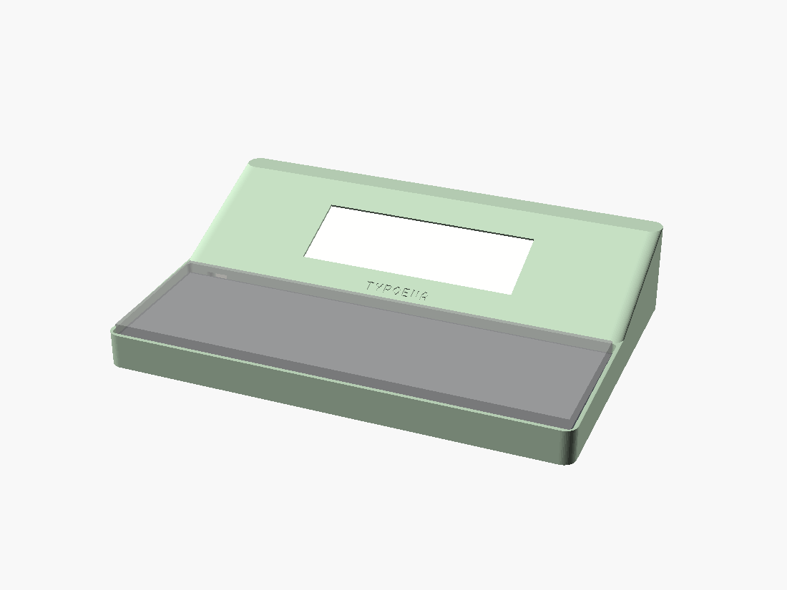
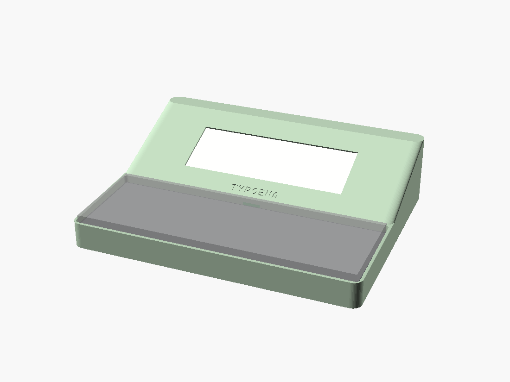
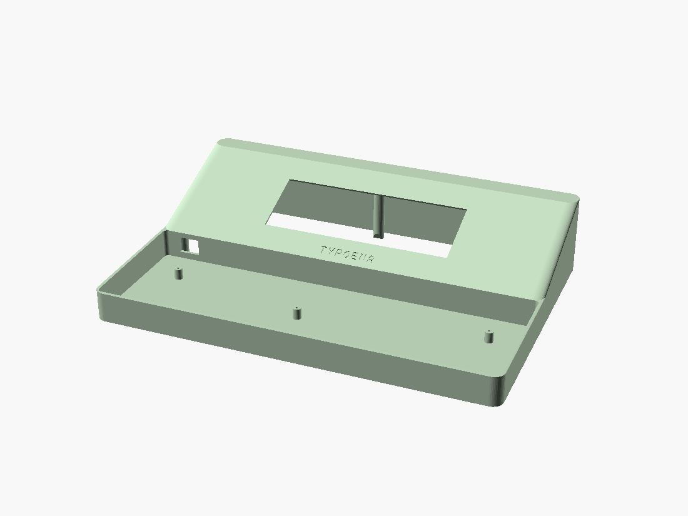
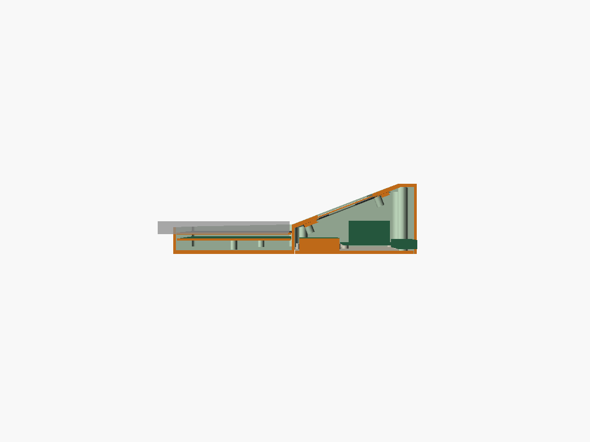
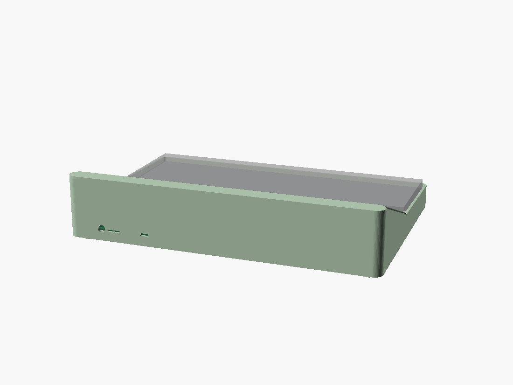

# Enclosure — integrated-keyboard variant (concept)

The one-piece [**Typoena**](../../README.md): the same reclined e-paper deck as
the [bring-your-own-keyboard body](README.md), with a keyboard tray grafted onto
the front — AlphaSmart / Freewrite silhouette, typewriter proportions. Two
sizes, both built on off-the-shelf QMK hotswap PCBs so "custom" means switches,
caps and keymap, not PCB design:

| `kb`   | keyboard                        | body (W × D)     | print               |
| ------ | ------------------------------- | ---------------- | ------------------- |
| `"60"` | GH60 footprint (DZ60, YMDK…)    | 291.3 × 202.4 mm | monolithic, 300 bed |
| `"40"` | OLKB Planck, ortholinear        | 239.2 × 189.8 mm | monolithic          |

> **Status: v0 concept, not yet printed.** The wedge half is inherited verbatim
> from the proven base model; the bay's tray-mount numbers are best-guesses
> marked `<< VERIFY >>` until checked against the real PCB drawing.

| 60% (GH60)                                                                                         | 40% (Planck)                                                              |
| -------------------------------------------------------------------------------------------------- | ------------------------------------------------------------------------- |
|  |  |

## How it composes

[`typoena-case-kb.scad`](typoena-case-kb.scad) `include`s the base model and
overrides only `W`: the whole wedge — screen clamp, PCB 1 back-left, PCB 2
back-right, front battery, baseplate, ports — re-derives at the new width and is
translated back by the bay depth. The bay is additive:

- **Tray mount.** The keyboard PCB screws to integral posts on the bay floor
  (standard GH60 tray positions for the 60%; Planck holes are placeholders).
  Plate floats on the switches, walls locate it with 0.75 mm wiggle. The rim
  (`Hk = 22` at the front) hides the plate edge, caps sit proud; toward the
  deck it rises to meet the wedge's front-top edge flush, so bay and deck
  join without a seam.
- **Internal USB.** The keyboard stays a stock QMK device. Its cable leaves
  through a slot in the shared wall into the wedge cavity. PCB 2's keyboard
  USB-C faces **out** the back wall, so it can't take an internal plug — PCB 2
  instead grows a **4-pin header (VBUS/D−/D+/GND) wired in parallel** with that
  connector, and the model fills the old port cutout: the back wall shows only
  charge, µSD and the power switch. (Direct matrix-on-GPIO — dropping the MT3608
  and USB host for wake-on-key — is a possible v2; it costs 19 pins plus matrix
  scan and a keymap in firmware.)
- **Floor + feet.** The bay has an integral 3 mm floor and its own front feet;
  the wedge keeps its drop-in baseplate for service access.





## Render / export

From `hardware/`:

```sh
just render-kb   # regenerate case/renders/kb*.png (both sizes)
just stl-kb      # kb60/kb40 body + baseplate STLs (bracket comes from `just stl`)
```

`show` accepts `kb_assembled` · `kb_body` · `kb_baseplate` · `kb_section` ·
`kb_print`. **`kb` and `W` move as a pair** (`"60"` → 291.30, `"40"` → 239.15);
an include-override must be a literal, so `W` can't follow `kb` by itself — the
model asserts if they drift.

## Verify before printing

- [ ] **Tray post positions** against the actual PCB drawing (`kb_holes`) — the
      GH60 set is the commonly-cited standard, the Planck set is a placeholder.
- [ ] **USB position + slot** (`kb_usb_x`, `kb_post_h`): the plug head must pass
      the shared-wall slot and clear PCB 2's cavity side.
- [ ] **PCB 2 header** for the internal keyboard cable (4-pin, parallel to the
      keyboard USB-C) — decide JST-PH vs soldered pigtail.
- [ ] Everything on the base model's own list (battery dims, active-area offset).
