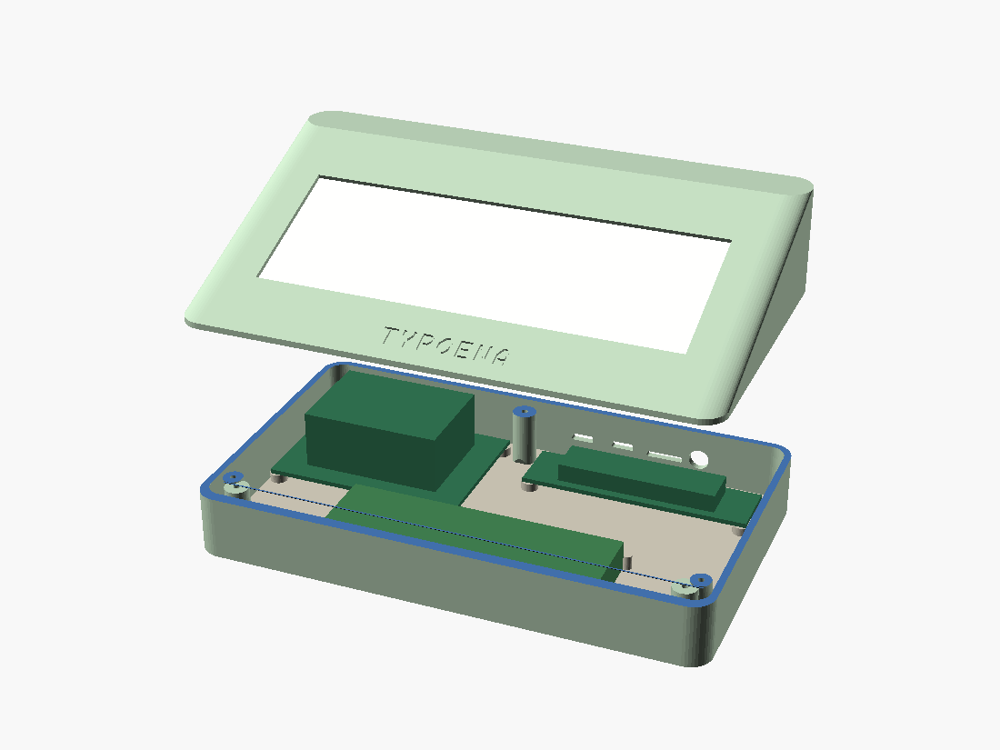
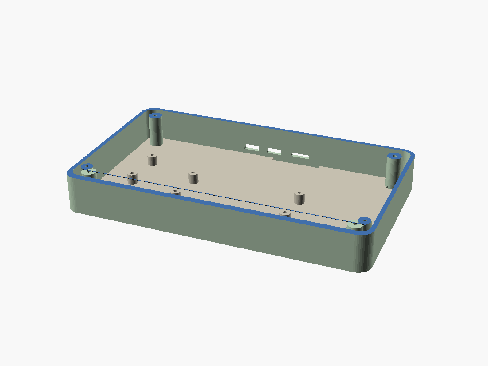

# Enclosure — Typoena body (concept)

A 3D-printable case for [**Typoena**](../../README.md), the distraction-free DIY
writing machine. The e-paper strip sits on a reclined **deck**, where a
typewriter's paper would be; you bring your own keyboard for the front. There is
no platen part (it complicates the print); the rounded back-top edge nods to one.

> **Status: v0 concept, not yet printed.** Outer form, screen retention, and the
> two-board mounting are worked out against the real hardware and render cleanly.
> The one open number is the battery: space is reserved for a **3700 mAh** cell,
> marked `<< MEASURE >>` until one is bought and measured.


## Files

| File                                     | What                                                    |
| ---------------------------------------- | ------------------------------------------------------- |
| [`typoena-case.scad`](typoena-case.scad) | The parametric model. All dimensions live at the top.   |
| [`concept.html`](concept.html)           | Dimensioned side/front/top drawing (open in a browser). |
| `renders/`                               | PNG previews (regenerated by `just render`).            |

## Render

Needs [OpenSCAD](https://openscad.org). From `hardware/`:

```sh
just render   # regenerate every case/renders/*.png
just stl      # export body / bracket / baseplate STLs
just open     # open the model in OpenSCAD
```

`show` accepts `assembled` · `body` · `bracket` · `baseplate` · `print_plate` ·
`section` (vertical cut) · `plan` (exploded horizontal) · `plan_up` / `plan_down`
(each half alone).

## Dimensions

Baked into the model from the datasheets:

- **Panel (GDEY0579T93):** glass 150.92 × 56.94 × 1.0 mm, active area
  139.00 × 47.74 mm, pitch 0.1755 mm.
- **PCB 1** (50 × 70 mm): ESP32-S3 devkit + e-ink driver + MT3608 5 V boost;
  ~10 mm stack, ~22 mm at the vertical F-F Dupont rows. Ø2 hole each corner.
- **PCB 2** (20 × 80 mm): µSD + two USB-C (charge, keyboard) + TP4056 charger;
  connectors overhang the board edge by 8 mm. Ø2 hole each corner.
- **Battery:** LiPo 3700 mAh, 96 × 33.5 × 10.3 mm, flat across the front.
- **Body:** 176 W × 104 D, 24 mm front → 58 mm back, deck reclined ~21°. Walls
  2.4 mm, deck 2.6 mm, corner radius 8 mm.

## How the hardware goes in (glueless)

No glue on the fragile 1 mm glass; every part stays serviceable.


**Screen.** The glass drops into the deck recess from behind (the walls locate it
in X/Y). Front to back the stack is: deck **bezel lip** (covers ~4–5 mm of the
inactive border only, `lip_t = 1.4 mm`) → **glass** → non-adhesive closed-cell
**foam** gasket (~1 mm, spreads the clamp load) → printed **bracket** screwed to 4
bosses. The lip stops the glass falling out the front; the bracket stops it
dropping into the cavity. The FPC folds back through an internal clearance on the
**left** (kept under the bezel, so invisible outside) to PCB 1's driver. For a
screwless build, cantilever clips work but point-load the glass edge; I'd default
to foam + bracket.


**Boards.** Mount everything to the **baseplate** on the bench, then close from
below.

- **PCB 1** back-left on low printed standoffs (`standoff_h = 3`, M2 self-tap into
  `pcb1_holes`). It's in the rear half because the tall Dupont stack (~22 mm) only
  clears under the high back of the wedge; the FPC exit is right above it.
- **PCB 2** back-right along the back wall (`pcb2_holes`); connectors poke out
  through the back-wall ports (`port_x` / `port_z`). From the right-wall end in:
  power switch, µSD, keyboard, charge.
- **Power on/off switch** — a latching push button (push-on / push-off) through
  the back wall on the µSD side (`pwr_*`). It breaks the battery-side power feed,
  so the machine is genuinely off between sessions instead of draining the LiPo;
  it sits clear of the typing path. No reset/BOOT button is exposed (S3
  auto-download makes both recovery-only); like the ESP32's own USB-C they're
  reached by opening the case.
- **LiPo** flat across the front in baseplate cage nibs (foam/VHB does the rest).
  The shallow (24 mm) front of the wedge is dead space the tall board stack can't
  use, and **3700 mAh is the biggest flat cell that fits it** (96 × 33.5 × 10.3);
  the heaviest part up front also keeps the centre of gravity low and forward. The
  latching power switch keeps that capacity from bleeding between sessions.
- The baseplate screws up into **three posts** (two front corners + one in the
  back gap between the boards; the back corners are taken by the standoffs). A
  **cable relief** notch lets the keyboard cable exit and route to the front.






**Assembly order.**

1. Lay glass into the deck recess, add foam, screw the bracket to the 4 bosses.
2. Screw PCB 1 (back-left) and PCB 2 (back-right) to the standoffs; set the LiPo
   into its front nibs.
3. Connect the FPC through the slot; run the PCB 1 ↔ PCB 2 ribbon and battery
   leads to the charger.
4. Screw the baseplate up into the three posts.

## Tune first

- **`Hb` (back height) → deck angle.** 18–22° is typewriter-shallow; raise toward
  ~28–35° if the screen reads too edge-on when sitting close.
- **`<< MEASURE >>` items:** the battery dims (`bat_*`) once bought, and
  `active_off_x/y` (the active area sits off-centre in the glass). Board/port
  numbers (`pcb1_*`, `pcb2_*`, `port_*`, `pwr_*`) are already set to the hardware.

## Print notes


- Material PLA/PETG. Body in matte **sage** (`#B6CEB4`), bracket/base in cream or
  brass — the two-tone reads "typewriter" for a filament swap.
- To make the recessed `TYPOENA` engrave read: a swipe of paint pen in the recess,
  or a 3–4 layer filament swap across the nameplate band mid-print.
- 2.4 mm walls + open bottom keep material low.
- Print body deck-up (or on its back) for little/no support; bracket and baseplate
  print flat. Nameplate font is set by `name_font` (current: **Monaspace
  Krypton**, `brew install --cask font-monaspace`; run `fc-cache -f` so the CLI
  finds it).


## Open questions / TODO

- [ ] Confirm the GDEY0579T93 active-area **offset** (FPC confirmed on the left);
      adjust `active_off_x/y`.
- [x] Real board mounting-hole + port coordinates — done (two-PCB build).
- [ ] Buy + measure the **LiPo** (3700 mAh, 96 × 33.5 × 10.3); confirm `bat_*` and
      the lead-exit side, then finalise the front pocket.
- [ ] Optional **hinged lid** over the deck (protects the glass in a bag) — called
      for in `docs/hardware.md`, not yet modelled.
- [ ] Decide feet: printed (modelled) vs. stick-on rubber bumpers.
