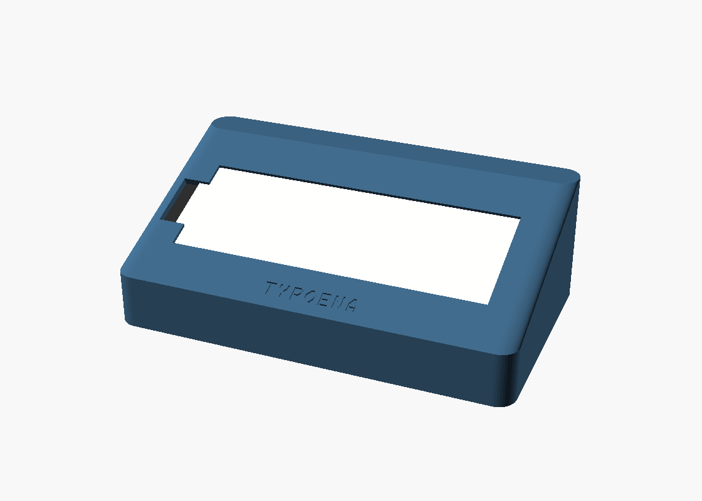
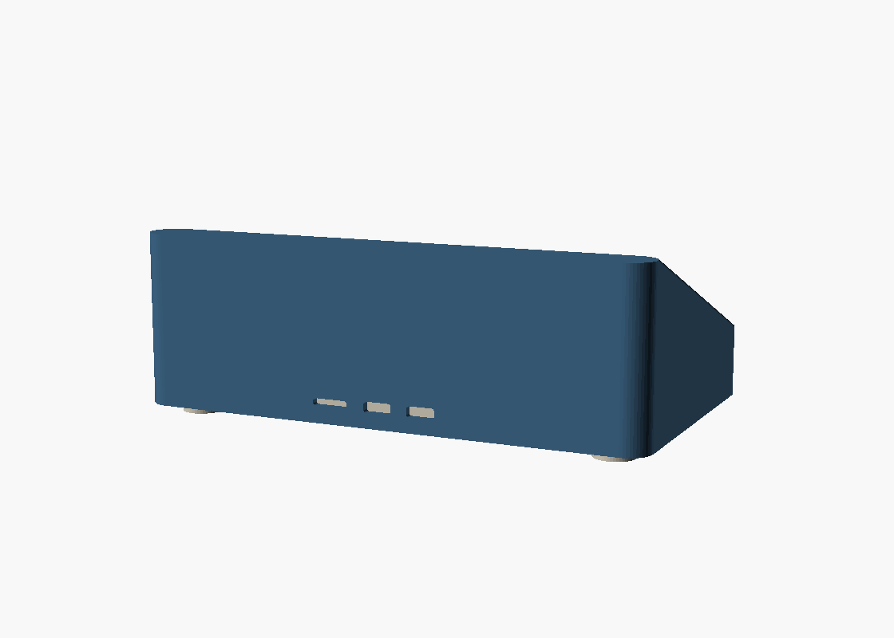
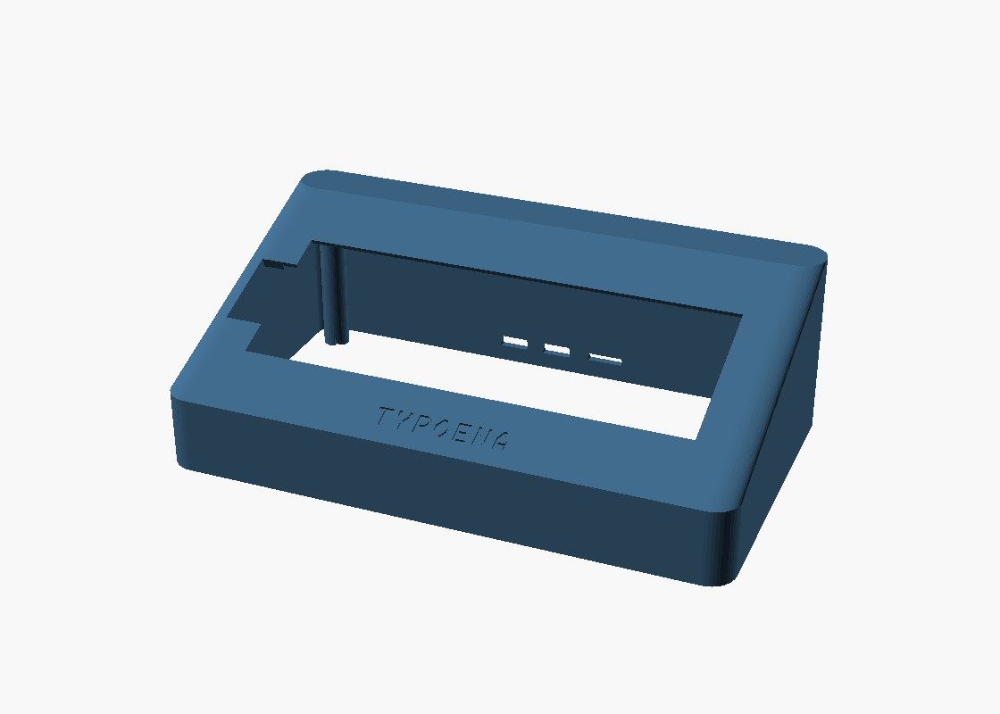
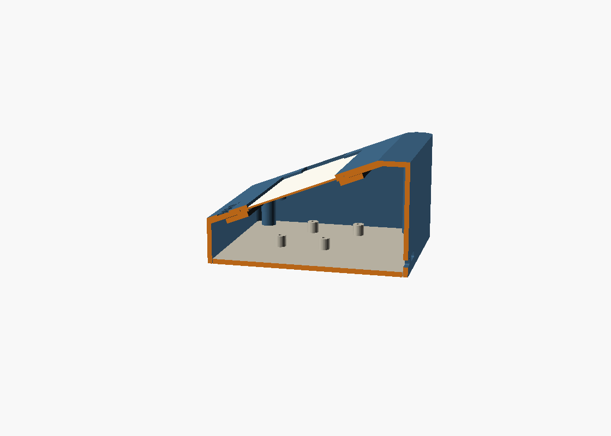
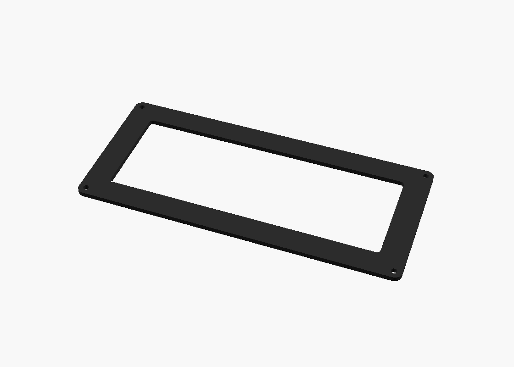
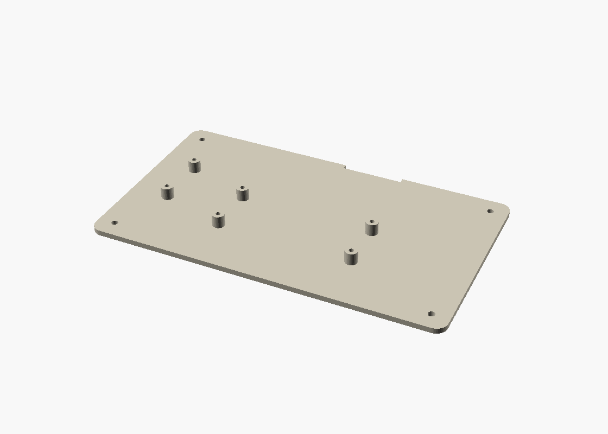
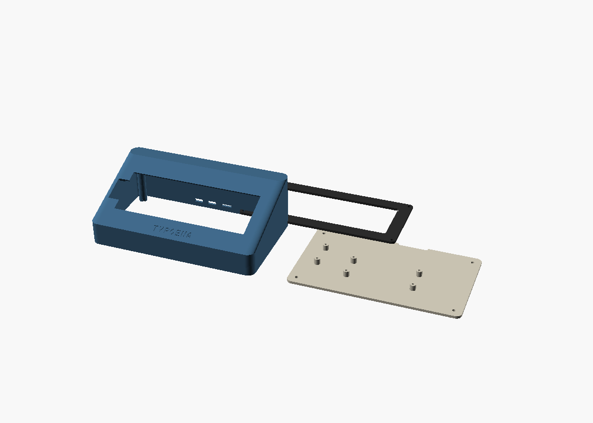
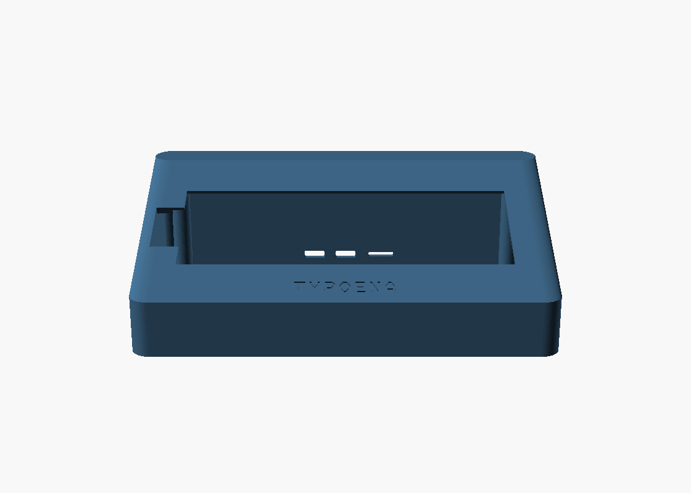

# Enclosure — typewriter body (concept)

Part of [**Typoena**](../../README.md) — the distraction-free DIY writing
machine. This page covers the enclosure only; the project root README covers
the whole appliance (hardware, software stack, roadmap).

A 3D-printable case for Typoena. The e-paper strip sits on a reclined **deck**
where a typewriter's sheet of paper would be; the keyboard you bring rests in
front. There is **no platen part** (it complicates the print) — the rounded
back-top edge is a subtle roll that nods to one for free.

> **Status: v0 concept, not yet printed.** Outer form and the screen-retention
> / board-mounting strategy are worked out and render cleanly. Board hole
> positions and port offsets are placeholders marked `<< MEASURE >>` in the
> `.scad` — confirm them against the real board before printing a final.




## Files

| File | What |
| --- | --- |
| [`typoena-case.scad`](typoena-case.scad) | The parametric model. All dimensions live at the top. |
| [`concept.html`](concept.html) | Dimensioned side/front/top drawing (open in a browser). |
| `renders/` | PNG previews (regenerated by the commands below). |

## Render / preview

Needs [OpenSCAD](https://openscad.org). Open `typoena-case.scad` in the GUI and
flip the `show` variable, or from the CLI:

```sh
cd hardware/case
# assembled, coloured, screen ghosted in
openscad -o renders/assembled.png --imgsize=1100,825 --colorscheme=Tomorrow \
  --camera=0,0,0,62,0,22,0 --viewall --autocenter \
  -D 'show="assembled"' typoena-case.scad

# export a printable part to STL (body | bracket | baseplate)
openscad -o body.stl -D 'show="body"' typoena-case.scad
```

`show` accepts `assembled` · `body` · `bracket` · `baseplate` · `print_plate`.

## Dimensions

From the datasheets, baked into the model:

- **Panel — GDEY0579T93:** glass outline **150.92 × 56.94 × 1.0 mm**, active
  area **139.00 × 47.74 mm**, pitch 0.1755 mm. Strip aspect ~2.9:1.
- **Board — ESP32-S3-DevKitC-1:** ~**70 × 28 mm**, USB-C ×2 + reset/boot on one
  short edge (that edge faces the back wall).
- **Body (default):** 176 W × 104 D, 24 mm front → 58 mm back, deck reclined
  **~21°**. Walls 2.4 mm, deck 2.6 mm, corner radius 8 mm.

The deck angle is the one knob worth tuning first — see below.

## How the hardware goes in — glueless

The whole design avoids glue on the fragile 1 mm glass and keeps every part
serviceable.



### Screen (bezel lip + foam + screwed bracket)

```
 front face                     the sandwich, front → back:
 ┌───────────────┐              1. deck BEZEL LIP  (overlaps ~4–5 mm of the
 │  ┌─────────┐  │                 glass's inactive border only, never the
 │  │ active  │  │ ← lip           active area — lip_t = 1.4 mm of material)
 │  └─────────┘  │              2. GLASS drops into the recess from behind;
 └───────────────┘                 the recess walls locate it in X/Y
                                 3. FOAM gasket (non-adhesive closed-cell,
   [lip][glass][foam][bracket]      foam_t ≈ 1 mm) spreads the clamp load
        ↑ screwed to 4 bosses       so you never point-crack the glass
                                 4. printed BRACKET, screwed to 4 bosses,
                                    presses the stack forward
```

- The through-**aperture** is a hair larger than the active area and stays
  *inside* the glass-minus-lip envelope, so the lip covers only dead border.
- The recess opens into the cavity, and an **FPC bay** — an open notch in the
  **left bezel** (the user's left as they face the screen) — lets the flex exit
  and fold down to the DESPI-C579 breakout below.
- Foam does three jobs: cushions the glass, takes up print tolerance
  (±0.2–0.5 mm), and removes any need for adhesive. Cut it from a plain EVA/
  PORON sheet — no sticky backing.
- Alternative if you want no screws: replace the bracket with printed
  cantilever clips. It works, but clips point-load the glass edge; the
  foam+bracket route is gentler and I'd default to it.

The lip alone can't hold the glass — it only stops it falling *out* the front.
The glass is **trapped at both edges** between the front lip and the rear
foam+bracket; the bracket is what stops it dropping *into* the cavity
(`show="section"`):





### Boards (the baseplate is the chassis)

Mount everything to the **baseplate** on the bench, then drop it in and close
from below — far easier than fishing screws inside a shell.

- ESP32 + DESPI-C579 sit on printed **standoffs** (M2.5 self-tap). Positions in
  `esp_holes` / `brk_holes` are placeholders — set them to your board's holes.
  No mounting holes on your board rev? Switch to slide-in edge rails.
- The **DESPI-C579 breakout** sits in the cavity on the **left**, right under the
  FPC exit; short SPI jumpers (MOSI/SCLK/CS/DC/RST/BUSY + 3V3/GND) run across to
  the ESP32. Keep that left channel clear.
- The baseplate screws **up into 4 corner posts** in the shell.
- A **cable relief** notch at the back lets the keyboard's USB-C cable exit and
  route around to the front.



### Assembly order

1. Lay glass into the deck recess (from inside), add the foam gasket, screw the
   bracket down onto the 4 bosses.
2. Screw ESP32 + breakout to the baseplate standoffs.
3. Connect the FPC (screen → breakout) through the slot.
4. Screw the baseplate up into the corner posts.

## Tune first

- **`Hb` (back height) → deck angle.** 18–22° is typewriter-shallow; raise `Hb`
  toward ~28–35° if the screen reads too edge-on when you're sitting close.
- **`<< MEASURE >>` items:** `esp_holes`, `brk_holes`, `port_x`, `port_z`,
  `active_off_x/y` (the panel's active area sits off-centre from the glass).

## Print notes



- **Material:** PLA/PETG. Print the body in matte **indigo** (`#130f40`), the
  bracket/base in cream or brass — two-tone reads unmistakably "typewriter" for
  the price of a filament swap.
- **Make the engrave read:** on a body this dark the recessed `TYPOENA` is
  near-invisible until you give it contrast — a swipe of paint pen in the recess,
  or a 3–4 layer filament swap across the nameplate band mid-print.
- **Shell, not solid:** 2.4 mm walls + open bottom keep material low despite the
  chunky body form.
- **Orientation:** body deck-up (or on its back) needs little/no support; the
  bezel lip is a small overhang. Bracket and baseplate print flat.

## Nameplate font



The `TYPOENA` engrave on the deck (recessed, faces the user) is set via the
`name_font` parameter. Current pick: **Monaspace Krypton** (GitHub's mechanical
mono). OpenSCAD only renders fonts installed on the system:

```sh
# current: Monaspace Krypton (installs the whole family)
brew install --cask font-monaspace

# alternative tried: Cutive Mono (typewriter slab-serif)
curl -sL -o ~/Library/Fonts/CutiveMono-Regular.ttf \
  https://github.com/google/fonts/raw/main/ofl/cutivemono/CutiveMono-Regular.ttf

fc-cache -f    # so the OpenSCAD CLI picks either up
```

To audition other faces: Google Fonts, filtered to monospace and previewing the
name —
<https://fonts.google.com/?preview.text=TYPOENA%0ATypoena%0Atypoena&categoryFilters=Appearance:%2FMonospace%2FMonospace>

## Open questions / TODO

- [ ] Confirm the GDEY0579T93 active-area **offset** (FPC confirmed on the left
      edge); adjust `active_off_x/y`.
- [ ] Real ESP32-S3-DevKitC-1 mounting-hole + port coordinates.
- [ ] Optional **hinged lid** over the deck (portable-typewriter-case echo,
      protects the glass in a bag) — `docs/hardware.md` calls for one; not yet
      modelled.
- [ ] Decide feet: printed (modelled) vs. stick-on rubber bumpers.
