# Enclosure — Typoena body

A 3D-printable case for [**Typoena**](../../README.md), the distraction-free DIY
writing machine. The e-paper strip sits on a reclined **deck**, where a
typewriter's paper would be; you bring your own keyboard for the front. There is
no platen part (it complicates the print); the rounded back-top edge nods to one.

> **Status: first full print done, second one pending.** Outer form, screen
> retention and the two-board mounting are worked out against the real hardware,
> and every number is measured — the **3700 mAh** cell included. Printed so far:
> the back-wall I/O coupon, which is what corrected the port openings; a first
> **baseplate**, which is what took the screw lamages out of the model (they
> printed badly and are drilled now, see
> [Drilling the baseplate](#drilling-the-baseplate)); and a first **body**, which
> assembled only after hand work — the screen would not enter its pocket and the
> PCB standoffs came out too close together. Both are the same cause and it is not
> a design fault: the machine shrinks **1.35 % in XY**, which cancels between
> printed parts and only bites where a printed part meets a bought one. That is now
> corrected **in the slicer** — see **[MANUFACTURING.md](MANUFACTURING.md)**, which
> is required reading before any print. The 7 heat-set inserts are still untried —
> see **Open questions / TODO**. The coupon **needs a reprint**: the opening *sizes*
> it validated still stand, but the wiring bay moved every one of them 2 mm up the
> wall.

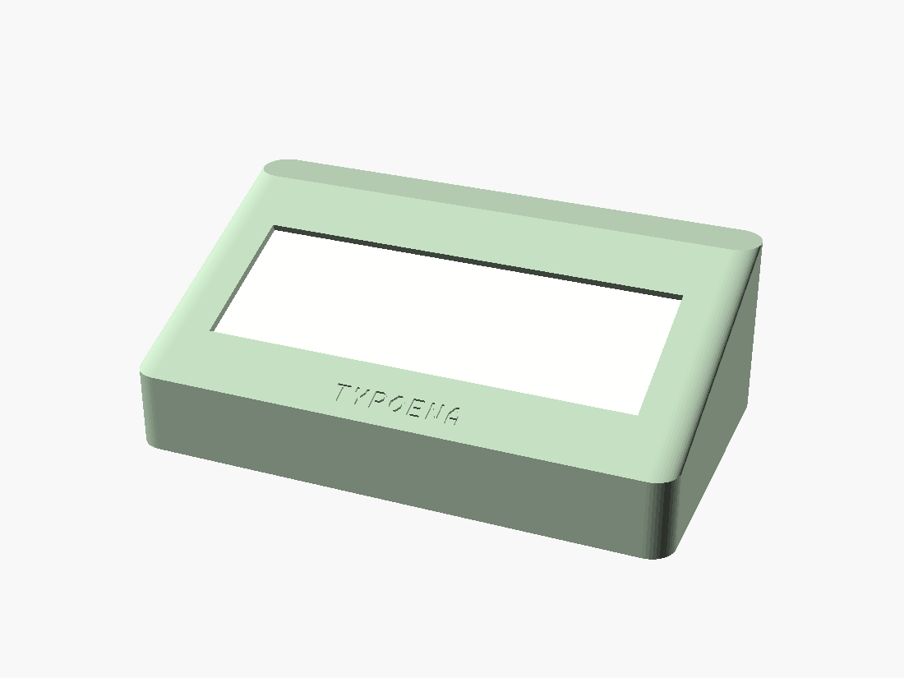
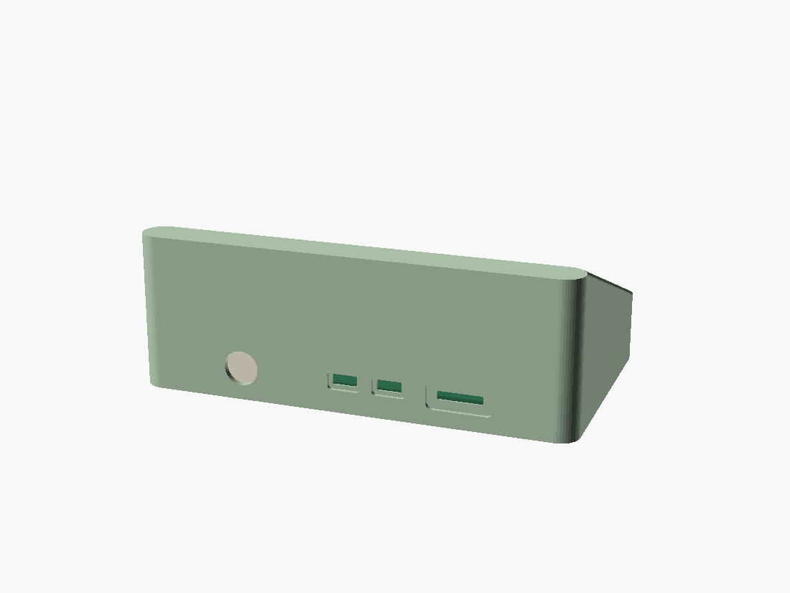

## Files

| File                                     | What                                                    |
| ---------------------------------------- | ------------------------------------------------------- |
| [`typoena-case.scad`](typoena-case.scad) | The parametric model, **nominal geometry**. All dimensions live at the top. |
| [`MANUFACTURING.md`](MANUFACTURING.md)   | **Slicer settings — read before printing.** The machine's shrink and over-extrusion are corrected here, not in the model. |
| [`typoena-case-kb.scad`](typoena-case-kb.scad) | Integrated-keyboard variant (60%/40%) — see [README-kb.md](README-kb.md). |
| [`concept.html`](concept.html)           | The **v0 concept sheet** as drawn, before the model existed. Its platen roller and knobs never shipped; the model wins on every dimension. |
| `renders/`                               | PNG previews (regenerated by `just render`).            |
| `*.stl`                                  | Mesh exports — generated on demand by `just stl`, not tracked. |

## Render

Needs [OpenSCAD](https://openscad.org). From `hardware/`:

```sh
just render   # regenerate every case/renders/*.png
just stl      # export every STL: body / bracket / baseplate / coupon / assembly
just stl-io   # re-export just the back-wall I/O fit coupon (quick test print)
just stl-feet # export the stick-on feet (deferred — see feet_mode)
just open     # open the model in OpenSCAD
```

The meshes aren't tracked — they're 5 MB of ASCII that git rewrites line by line
on any geometry change. For a shareable set, tag instead: `git tag case-vX.Y.Z &&
git push origin case-vX.Y.Z` has CI export from the tagged commit and publish
`stl.zip`, `stl-kb.zip` and the I/O coupon to
[Releases](https://github.com/typoena/typewriter/releases).

`show` accepts `assembled` · `body` · `bracket` · `baseplate` · `feet` ·
`print_plate` · `section` (vertical cut) · `plan` (exploded horizontal) ·
`plan_up` / `plan_down` (each half alone) · `io_coupon` (the I/O fit test print).

## Dimensions

Baked into the model from the datasheets:

- **Panel (GDEY0579T93):** glass 150.92 × 56.94 × 1.0 mm, active area
  139.00 × 47.74 mm, pitch 0.1755 mm.
- **PCB 1** (50 W × 70 D mm): ESP32-S3 devkit + e-ink driver + MT3608 5 V boost;
  ~10 mm stack, ~22 mm at the vertical F-F Dupont rows. Ø2 hole each corner.
  Stands with its **long axis front-back**, FPC end forward.
- **PCB 2** (80 W × 20 D mm): µSD + two USB-C (charge, keyboard) + TP4056 charger;
  connectors overhang the board edge by 8 mm. Ø2 hole each corner.
- **Battery:** LiPo 3700 mAh, 94 × 32 × 10.3 mm, flat in the front-right.
- **Body:** 176 W × 104 D, 28 mm front → 62 mm back, deck reclined ~21°. Walls
  2.4 mm, deck 2.6 mm, corner radius 8 mm.

## How the hardware goes in (glueless)

No glue on the fragile 1 mm glass; every part stays serviceable.

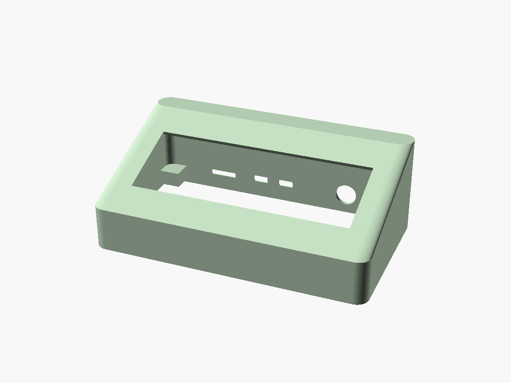

**Screen.** The glass drops into the deck recess from behind (the walls locate it
in X/Y). Front to back the stack is: deck **bezel lip** (covers the inactive
border only, `lip_t = 2.4 mm`) → **glass** → non-adhesive closed-cell **foam**
gasket (`foam_t = 5 mm` free, squashed to `foam_c = 3.5` — a 30% squash) → printed
**bracket**
screwed to 4 bosses. The lip stops the glass falling out the front; the bracket
stops it dropping into the cavity. The FPC folds back through an internal
clearance on the **left** (kept under the bezel, so invisible outside) to PCB 1's
driver. For a screwless build, cantilever clips work but point-load the glass
edge; I'd default to foam + bracket.

The bosses' **free ends are the bracket's seating face** (`br_seat = 6.9 mm` below
the deck's outer face). The screw pulls the bracket onto that shoulder and stops,
so the foam squash — and therefore the clamp on a brittle panel — is set by
geometry rather than by how hard you turn the screwdriver. That is also why the
foam is 5 mm and not 1: the seat has to sit far enough behind the glass to leave
the boss room for a **heat-set insert** (see *Fasteners* below). The bore stops
`pilot_skin = 2.1 mm` short of the deck's outer face, so nothing shows on the side
the user looks at — and that skin, not the thread, is what set `lip_t`.

Locating tolerances: the pocket gives the glass **0.25 mm of play per side** in X
and Y, against a window margin of 1.00 mm (X) / 0.50 mm (Y) over the active area —
so a drifted panel shifts the bezel by a quarter of a millimetre and can never clip
a pixel. Don't try to make the bracket locate anything either way: the pocket
locates, the bracket only clamps. Its clearance holes are **Ø3.9 on a Ø3.5 shank** —
drive the screws through the bracket rather than expecting it to drop over them.

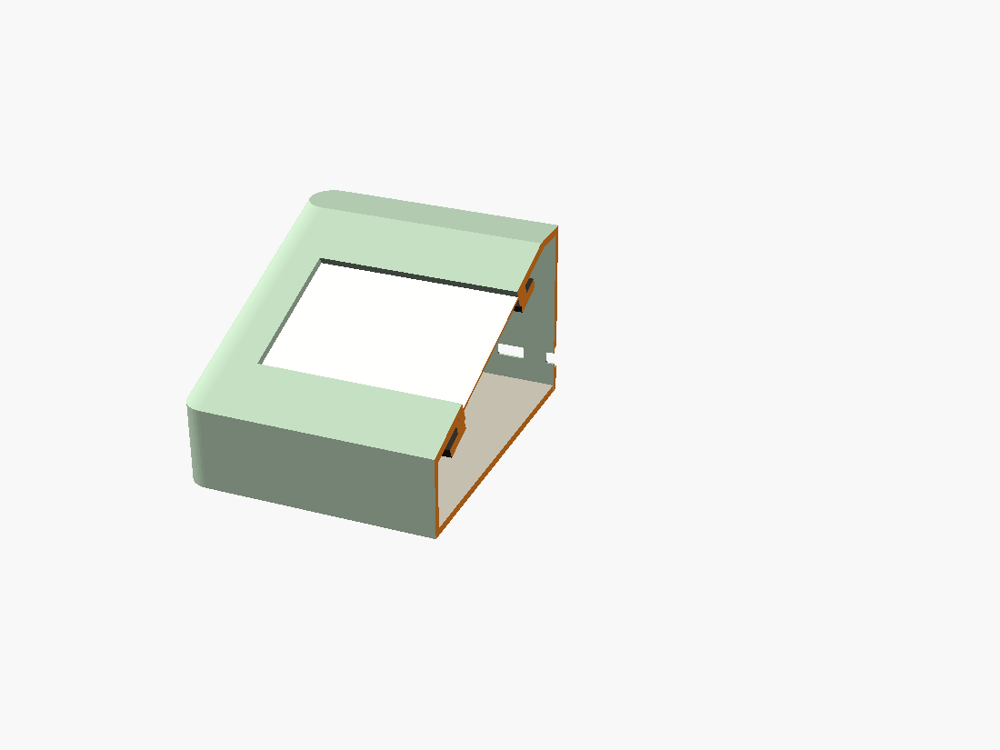
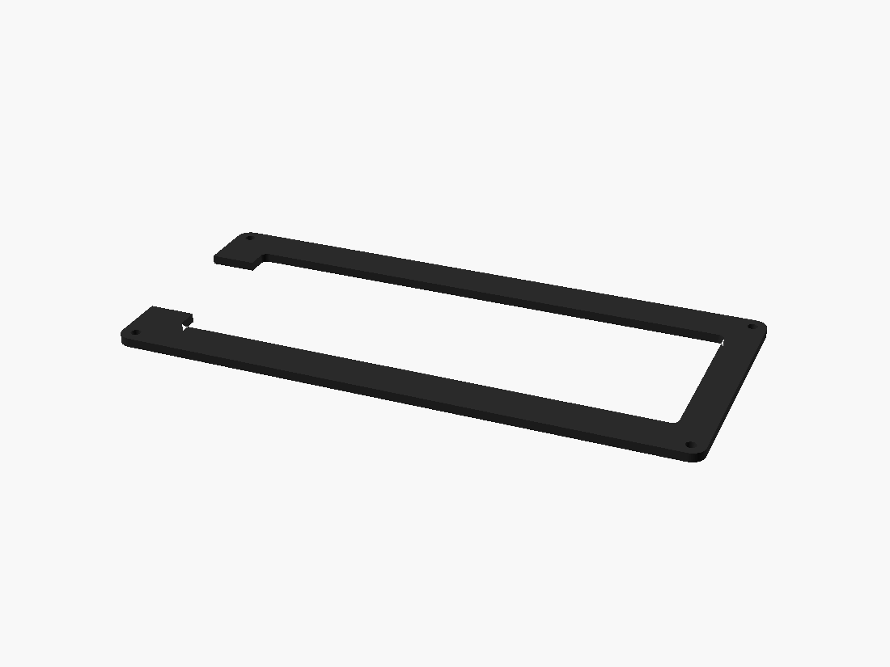

**Fasteners.** Everything that screws into the **body** uses one family: a
**ruthex RX-6-32×3.8** brass heat-set insert (Ø4.7 body, 3.8 long, datasheet bore
**Ø4.8 × 4.8 min**, **1.8 mm minimum wall**) taking a **#6-32** pan screw — 7 mm
of thread under a flat 1 mm × Ø6.5 head. Both parts are measured, not
catalogue numbers. These are the two joints that get *opened*: the baseplate on
every service, the bracket on every glass swap, and a self-tapped thread in PLA is
good for a handful of cycles before it's a stripped hole in a 10-hour print.

| | bracket → deck (×4) | baseplate → body (×3) |
| --- | --- | --- |
| boss | Ø8.9 (was Ø6.8), **2.05 mm** of wall | rectangular pad, **2.6 mm** to the free faces |
| bore | Ø4.8 × 4.8 blind, **2.1 mm of deck** left over it | Ø4.8 × 6.6 blind, 3.4 mm of roof |
| screw crosses | 3.6 mm of bracket | 1.4 mm of plate |
| thread in brass | **3.4 mm** | **3.8 mm** (the whole insert) |
| head | **no lamage** — bears on the bracket's face, inside the case | in a **lamage** in the plate's underside, flush with the desk — **drilled, not printed** (see [Drilling the baseplate](#drilling-the-baseplate)) |

Both bores are **plain Ø4.8 cylinders** — no relief, no step, no lead-in for the
insert's head end: the iron melts its own seat, so the bore is not a clearance fit
and nothing about the insert's outline is modelled. There is no counterbore left
anywhere in the model: the baseplate's three passages come out of the printer
**solid** and are drilled afterwards.

That Ø4.8 is what Ruthex asks for around a Ø4.7 body: the insert melts its own
seat, so this is a grip, not a clearance fit. No insert has been set yet, and the
first body printed this bore at ~Ø4.57 rather than Ø4.8 — judge the first insert
on a correctly sliced part.

Both bores are deliberately **deeper than the insert** (they have to swallow the
screw tip), and with the relief gone **nothing in the part stops the press**. Sink
each insert flush with the boss's free end by eye or with a depth stop on the iron:
that face is a seating face on both joints — proud brass spends the foam preload on
the bracket, and rocks the plate on the baseplate.

The **PCBs are not in this family.** They screw *down* into the baseplate, whose
standoffs are 5 mm tall — nowhere near an insert's 4.8 mm bore even so. They stay
**M2 self-tappers into Ø1.6 pilots** — but those pilots, like the three screw
passages, are **drilled, not printed** (see
[Drilling the baseplate](#drilling-the-baseplate)). A Ø1.6 hole is two or three
perimeters wide, so the printer rounds it to whatever its extrusion width allows and
the self-tapper arrives at a hole of unknown size; a bit cuts 1.6.

The depth budget is why `lip_t` went 1.4 → 2.4 and `bracket_t` 2.6 → 3.6. Between
the bracket's seat and the deck's *outer face* there is only `br_seat`, and the
bore eats it from below: 6.9 = bore 4.8 + skin 2.1. At the old numbers the bore came
to 5.4 against a `br_seat` of 5.9 — **0.5 mm** of skin on the machine's showpiece
face, with the screw tip arriving under it and the iron melting brass into it.
There is nowhere else to buy that skin, so it came half from the visible lip (a
deeper bezel well) and half from the invisible bracket, and the
glass ends up 1 mm deeper in a stiffer clamp. `typoena-case.scad` **asserts** the
walls, the skin, the roof and the thread engagement — a plausible-looking edit to
any of those four numbers fails the render instead of the print.

**Boards.** Mount everything to the **baseplate** on the bench, then close from
below.

Both boards sit on **5 mm printed standoffs** (`standoff_h`). That gap is the
**wiring bay**: PCB 1's underside carries the boost/driver interconnect and the
battery feed, PCB 2's the charger leads and the ribbon back to PCB 1, and at the
3 mm of the first build there was nowhere for any of it to go.

- **PCB 1** back-left on those standoffs (M2 self-tap into the pilots drilled at
  `pcb1_holes`), **turned so its long side runs front-back** (x 4…54, y 26…96).
  That orientation is what gives the screen ribbon a run: the board's FPC end sits
  at the **front-left**, right under the front end of the deck slot (which reaches
  y ≈ 27), and the front-left corner ahead of it — 56 × 24 mm of floor, open to
  the deck — is the **flex plenum** where the 100 mm extension's slack lives. The
  header side lands on the board's **back** edge, so the ~22 mm Dupont rows stay
  under the high rear of the wedge and the ribbon to PCB 2 stays short.

  The board's **front edge is the tightest spot in the cavity**, and it is what
  set the body's height. Turning the board moved it out of the tall rear into the
  shallow front and cut the clearance over it from 8.5 mm to **0.75 mm** — positive,
  but no margin at all, and the ~22 mm figure is the loosest measurement in the
  model (how tall the F-F Dupont rows stand depends on how they seat). So `Hf`/`Hb`
  carry **+4 mm** over the original 24/58, bought in two goes: +2 to get that
  0.75 back to a workable **2.75 mm**, and +2 more when the wiring bay took
  `standoff_h` from 3 to 5 and would otherwise have spent the first +2 straight
  back. At 28/62 the ceiling is 32.35 mm there and the 29.6 mm stack (plate +
  standoff + board) clears by 2.75 mm again.

  That pair moves **together** on purpose. `theta` is their difference over the
  pillar span, so a matched shift translates the deck plane vertically and leaves
  the recline (21.12°), `deck_L`, `screen_cy` and the whole screen clamp untouched —
  the only visible cost is a machine 4 mm taller at both ends than the first
  sketch. Raising `Hf` alone would have flattened the deck by ~1°. The tall rows
  still belong at the back edge, and that 2.75 is a floor rather than slack: the
  model now **asserts** it (`pcb1_ceiling`), so raising `standoff_h` or dropping
  the heights without the other fails the render instead of the print.
- **PCB 2** back-right along the back wall (`pcb2_holes`); connectors poke out
  through the back-wall ports (`port_x` / `port_z`). From the right-wall end in:
  power switch, µSD, keyboard, charge.
- **Power on/off switch** — a latching push button (push-on / push-off) through
  the back wall (`pwr_*`), Ø13.5 barrel, centre **20 mm in from the right outer
  face** (`pwr_inset`). It carries **gate signal only** (µA) — it drives the
  soft-power latch that opens the load path, so the machine is genuinely off
  between sessions instead of draining the LiPo, and firmware still shuts down
  cleanly on flip-off; contract in
  [v0.10](../../docs/v0.10-battery-and-sleep.md#power-switch--power-path--decided-2026-07-26).
  It sits clear of the typing path. It is a **loose part wired back to `J5` on
  PCB 1** (where the latch lives), not mounted on either board.

  At Ø13.5 it cannot sit beside PCB 2: the board runs to x ≈ 167.6, leaving only
  6 mm to the right wall, and the one clear X band is the board gap. Turning PCB 1
  widened that gap from 13.6 to 33.6 mm without helping — the back-centre baseplate
  boss sits in the middle of it and leaves 12.3 mm a side, still under Ø13.9. So
  the barrel flies **over** the board, and the gap underneath is deliberate
  headroom for parts PCB 2 doesn't carry yet: `pwr_z` reserves `pwr_clear = 4 mm`
  above `pcb2_h`, which leaves **10.4 mm of build height free above the board
  face** across the button's footprint. The driver is `pwr_body_d` (nut across
  corners / body OD, 14 mm measured), *not* the barrel Ø: the nut is the widest
  thing behind the panel and therefore the part that reaches lowest.

  No reset/BOOT button is exposed (S3 auto-download makes both recovery-only);
  like the ESP32's own USB-C they're reached by opening the case.

  `pwr_inset` has **~5 mm of travel left**, and the limit is the nut's flat seat,
  not the hole: the back face is planar only to x = 168 (`W - corner_r`), so the
  Ø14 nut runs off the corner blend below an inset of ~15. Not worth spending —
  it buys gap to the µSD that nothing can see, and the nut already seats on flat
  wall at the default 20.

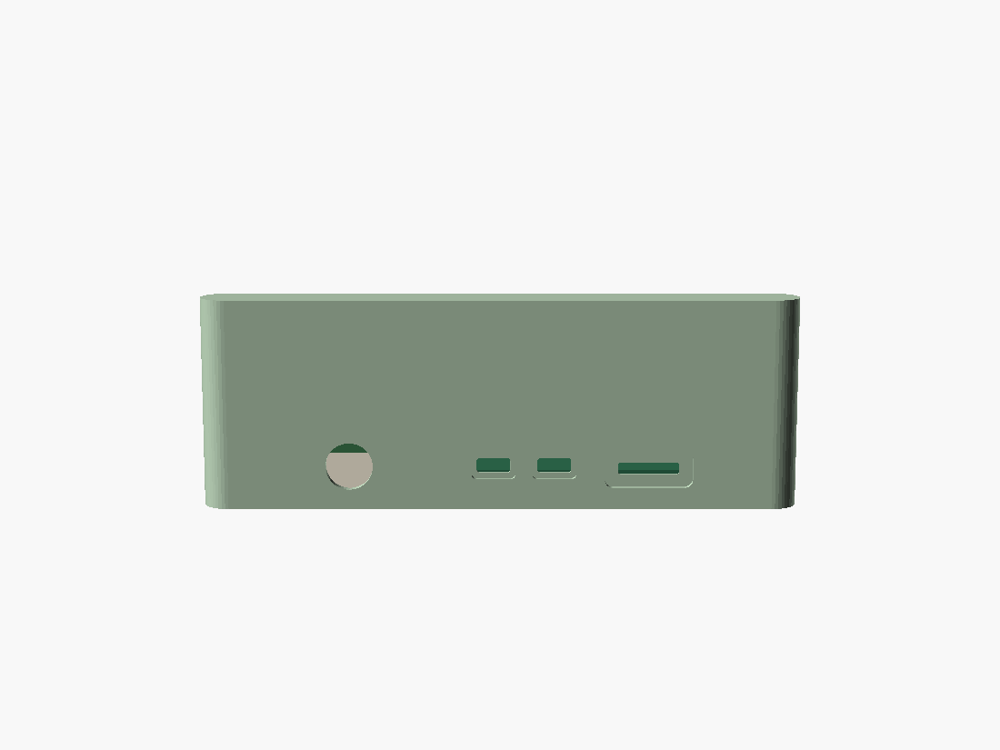
- **LiPo** flat in the **front-right** in a baseplate cage (foam/VHB does the
  rest) — the void inside the **L** the two boards make, PCB 1 down the left and
  PCB 2 across the back. The shallow (28 mm) front of the wedge is dead space the
  tall board stack can't use, and **3700 mAh is the biggest flat cell that fits it**
  (94 × 32 × 10.3); the heaviest part up front also keeps the centre of gravity
  low and forward. The latching power switch keeps that capacity from bleeding
  between sessions.

  The cage is **not symmetric**. A **wall** stands at the cell's left end and two
  **nibs** sit at its mid-length: the cell goes in from the right, passes between the
  nibs — which hold it in Y only — and slides left until it stops on the wall. The
  v1 four-corner nib cage went because the two left nibs printed poorly and located
  nothing the wall doesn't locate better; the surviving pair moved to mid-length
  because that is where a pouch cell bows, and it is the one spot from which neither
  end of the cell can lever itself out.

  It is **not centred on the case** — the front-left corner it used to cross is the
  flex plenum, and that is the point of the layout. X is boxed in both ways, and the
  **wall is pushed as far left as PCB 1 allows** so that everything left over lands
  on the boss side, where it is air rather than a rigid corner against a pouch cell:

  | | x |
  | --- | --- |
  | PCB 1's right edge | 54 |
  | cage wall (`bat_wall_t` = 2) | 58 … 60 |
  | cell (94 long) | **60 … 154** |
  | nibs (`bat_nib_x`) | 107 |
  | front-right screw boss, free face | 160 |

  That is **4 mm** of air behind the wall and **6 mm** ahead of the cell. Both are
  asserted (`battery: the cell runs into the front-right screw boss`, `battery: the
  cage wall has backed into PCB 1`) — `bat_x0` is set 300 lines from `post_xy`, and
  a plausible edit to either would close the gap in silence.
- The baseplate screws up into **three bosses** (two front corners + one in the
  back gap between the boards; the back corners are taken by the standoffs). Each
  is a rectangular pad **fused into the walls it sits against** — the box in
  `post_box` is driven straight through the shell and `body_outer()` trims it
  flush, so the fusion can't drift when `wall` or `corner_r` moves. They start at
  `bp_t` so the plate seats *under* them; the 2.6 mm void that leaves is the
  plate's own volume, and the boss's first layer bridges off the wall. They are
  only `post_h` = **10 mm** tall: the walls carry the boss, so height is purely
  about clearing the Ø4.8 × 6.6 insert bore with a roof left on it. Running them
  to the deck was 67% more plastic propping nothing the walls weren't already
  carrying. The insert goes in from **below**, into the boss face the plate seats
  against — the iron reaches it straight down through the open bottom of the shell,
  so press all three *before* any board goes in. The **back** post sits 7.5 mm off
  the wall's inner face (was 6): the plate has to keep ≥3 mm of rim outboard of the
  Ø6.9 lamage for the head to pull against, and at 6 that rim was 1.8 mm. That rim
  now also absorbs the wander of a lamage that is drilled by hand.

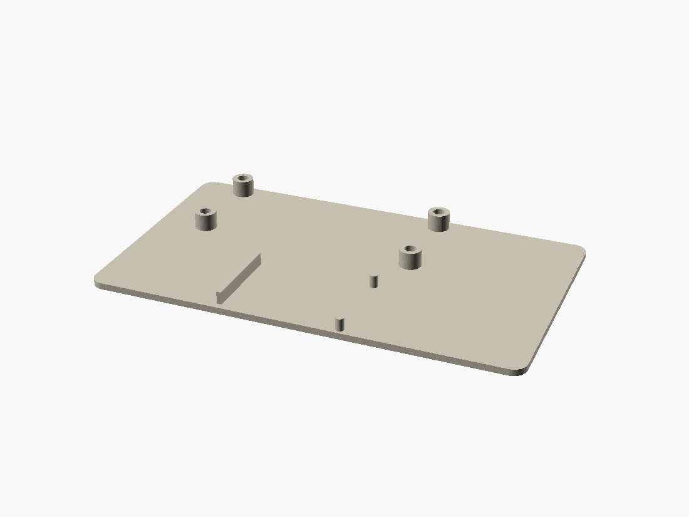
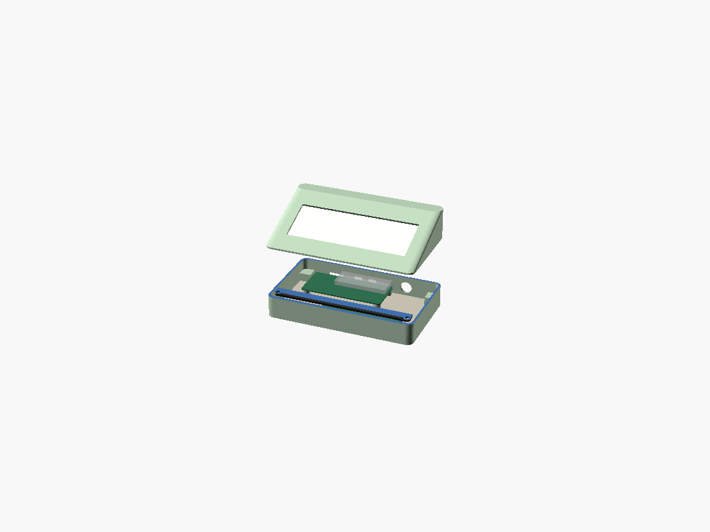
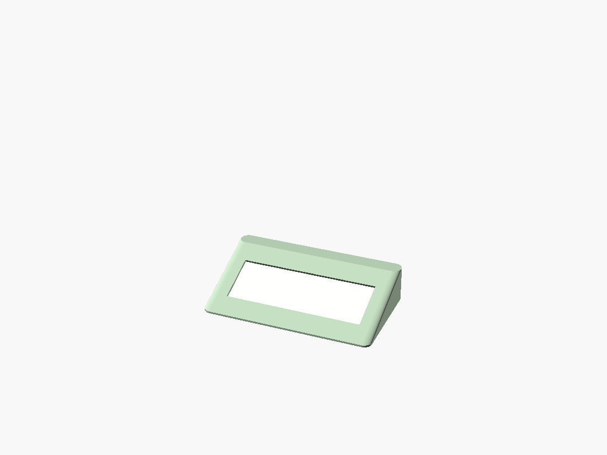
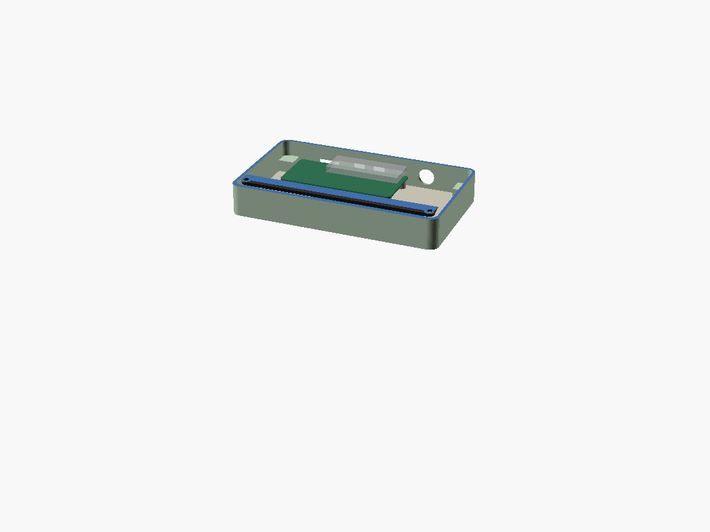

**Assembly order.**

0. **Drill the baseplate** — 3 screw passages + 8 standoff pilots, none of them are
   in the print. Mark the screw positions through the still-empty Ø4.8 baseplate
   boss bores first; doing that before the inserts go in is what makes the marking
   possible. See [Drilling the baseplate](#drilling-the-baseplate).
1. **Press the 7 inserts, on the bare body**: 4 into the bracket bosses under
   the deck, 3 into the baseplate bosses (from below). Iron at ~250 °C, straight
   in, stop when the brass is **flush with the boss's face** — the bore is deeper
   than the insert, so nothing bottoms out for you. The bracket four point at the
   deck's visible face with 2.1 mm of PLA behind them — these are the ones to go
   slowly on.
2. Lay glass into the deck recess, add foam, screw the bracket to the 4 bosses
   (#6-32 × 7). Drive them until the bracket sits flat on the boss shoulders and
   stop — the shoulder is the stop, not the foam.
3. Screw PCB 1 (back-left, FPC end forward) and PCB 2 (back-right) to the
   standoffs (M2 × 6 self-tappers into the drilled pilots); set the LiPo into its
   front-right cage — slide it in from the right, past the two nibs, until it stops
   on the wall.
4. Connect the FPC through the slot into PCB 1's front-left end, and coil the
   extension's slack into the front-left plenum; run the PCB 1 ↔ PCB 2 ribbon and
   the battery leads to the charger.
5. Screw the baseplate up into the three bosses.

### Drilling the baseplate

**The baseplate has no hole in it at all** — it is a pure union. Both fastener
features are drilled after the print, because both came out badly on the first plate.

Nothing else about the plate changed: the pad diameters, the standoff height and all
the positions are still the model's.

#### The three body screws

The lamage is a flat-bottomed pocket in the plate's *first* layers, so the print has
to bridge from Ø7.4 back in to Ø3.9 over open air, and the seat the head pulls
against ends up being whatever that bridge sagged to. A drill gives a flat seat.

Two features per hole, from the plate's **underside** (the face that meets the
desk):

| | Ø | depth | what it is |
| --- | --- | --- | --- |
| through hole | **3.9** (Ø4 bit) | through 2.6 | #6-32 shank clearance — the screw is turned through it |
| lamage | **6.9** (Ø7 bit) | **1.2**, flat-bottomed | the Ø6.5 × 1 pan head, finishing 0.2 **below** the face |

Flat-bottomed, not a countersink: the head is a flat 1 mm pan and a cone would only
touch it on one rim circle. The head must finish below the underside — with
`feet_mode = "none"` that face is what the machine stands on, and a proud head makes
it rock on three of four points. Drill the lamage **first**, then the through hole
through its centre: a twist bit's point needs full material to centre on.

Positions, from the plate's front-left corner (the long edge is the front; the plate
is 169.7 × 97.7):

| screw | x | y |
| --- | --- | --- |
| front-left | 7.85 | 7.85 |
| front-right | 161.85 | 7.85 |
| back-centre | 67.65 | 90.95 |

Better than measuring: **transfer from the body, before the inserts go in.** The
three boss bores are plain Ø4.8 holes at that point, open from below and pointing
straight down at the seated plate — sit the plate in the shell and mark their
centres through them (a Ø4.8 transfer punch, or a pointed marker and then a centre
punch). Press the inserts afterwards; once the brass is in, its ~Ø2.9 thread no
longer lines a bit up on anything. The back screw keeps ≥3 mm of plate rim outboard
of its lamage, which is the wander budget for doing this by hand.

#### The eight standoff pilots

Same story at the other end of the scale: **Ø1.6 is two or three perimeters wide**,
so the printer rounds the hole to whatever its extrusion width allows and the M2
self-tapper arrives at a hole of unknown size — sometimes nothing to bite, sometimes
a split standoff. A bit cuts 1.6.

One hole per standoff, **Ø1.6, from the top face, 6 mm deep** — that is the whole
thread the design ever had, and it leaves 1.6 mm of plate under the bit. Put a tape
flag on the drill: going through only opens a Ø1.6 hole in the underside, but it is
a dust path and the plate is the face the machine stands on. The Ø6 pad leaves
2.2 mm of wall all round, so there is room for the bit to wander a little.

**Screw length: M2 × 6.** The board is 1.6 mm, the pilot 6 mm, so a ×6 bites 4.4 mm
and a ×8 bottoms 0.4 mm short of seating and lifts the board off its standoff.

Positions, same frame as above (front-left corner of the plate). PCB 1's four are on
a **46 × 66** grid, PCB 2's on **76 × 16**; every centre is 2 mm in from its board
edge, which is the only rule — the rest falls out of `pcb1_*` / `pcb2_*`.

| | x | y | |
| --- | --- | --- | --- |
| PCB 1 front-left | 2.85 | 24.85 | ESP32 + driver + boost, back-left, |
| PCB 1 front-right | 48.85 | 24.85 | long axis front-back |
| PCB 1 back-left | 2.85 | 90.85 | |
| PCB 1 back-right | 48.85 | 90.85 | |
| PCB 2 front-left | 86.45 | 72.45 | µSD + 2× USB-C + TP4056, |
| PCB 2 front-right | 162.45 | 72.45 | along the back wall, right end |
| PCB 2 back-left | 86.45 | 88.45 | |
| PCB 2 back-right | 162.45 | 88.45 | |

Here there is no transfer trick — nothing in the body lines these up. Mark them off
the plate's own edges, or lay a board on its four standoffs and scribe through its
Ø2 holes, which is more accurate than the tape measure and is the fit that actually
matters.

The keyboard variant's bay posts (`bay_posts()` in `typoena-case-kb.scad`) are solid
for the same reason and drill the same way.

## Tune first

- **`Hb` (back height) → deck angle.** 18–22° is typewriter-shallow; raise toward
  ~28–35° if the screen reads too edge-on when sitting close.
- **Everything else is pinned to a part.** The cell (`bat_*`), the panel's
  active-area offset (`active_off_x/y`) and the board/port numbers (`pcb1_*`,
  `pcb2_*`, `port_*`, `pwr_*`) are all measured — move them only against a new part.

## Print notes

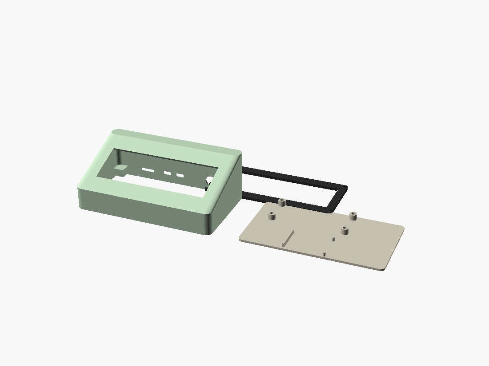

- Material PLA/PETG. Body in matte **sage** (`#B6CEB4`), bracket/base in cream or
  brass — the two-tone reads "typewriter" for a filament swap.
- 2.4 mm walls + open bottom keep material low.
- **Print the I/O coupon first.** `just stl-io` exports `io-coupon.stl` — a flat
  slice of the real back wall carrying only the four openings (2× USB-C, µSD,
  power button) at their real spacing and wall thickness. Print it face-down (no
  support, ~45 min), dry-fit the connectors, the card and the switch, and adjust
  `usbc_*` / `sd_*` / `pwr_fit` before committing to the body print. At 45 minutes
  a round it is not a guess-and-reprint loop: caliper the parts, then size the
  openings loose (`port_fit`) so one print clears.

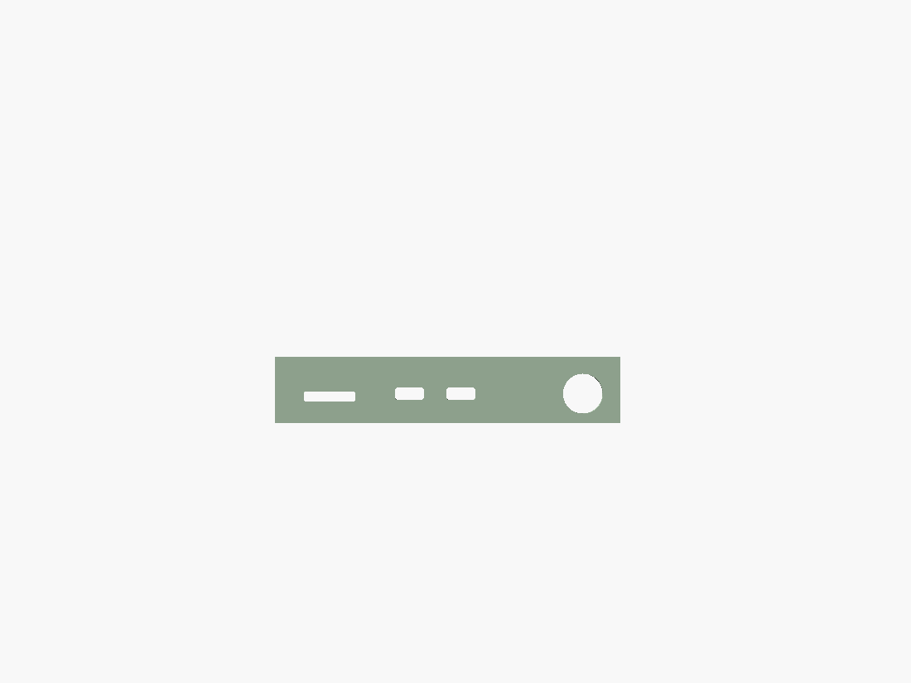
- Print body deck-up (or on its back) for little/no support; bracket and baseplate
  print flat.
- **The STLs are nominal — the slicer carries the corrections.** Scale and XY
  compensation are not optional and not in the model; a part sliced without them
  will not assemble. Values: **[MANUFACTURING.md](MANUFACTURING.md)**.
- **Check the fit that goes tight first:** the baseplate must drop into the shell
  with ~0.25 mm of play a side, no force. Both its mating faces are printed, so it
  loses twice whatever the process loses. Worth repeating on every new filament.
- **The deck ships blank** — `name_on = false`. The engraved `TYPOENA` nameplate
  is still modelled and comes back with that one flag; it sits in the band between
  the front edge and the screen, the only free deck area there is. If it does come
  back it needs `name_font` installed (**Monaspace Krypton**, `brew install --cask
  font-monaspace`, then `fc-cache -f` so the CLI finds it) and something to make
  the recess read: a swipe of paint pen, or a 3–4 layer filament swap across the
  band mid-print.
- **No feet on this version** (`feet_mode = "none"`). They are modelled and can
  come back as their own part with `feet_mode = "separate"` + `just stl-feet` —
  four Ø14 × 3.5 discs, the front pair concentric with the screw bosses and bored
  at the lamage Ø so a **driver** still reaches the recessed head (a shank-sized
  hole would put it out of reach and the plate could never come off). Glue them on
  *after* drilling, and off the drilled holes rather than off the model. What they must *not* go back to
  is `"fused"`: hanging off the plate they leave it resting on four small discs,
  turning the whole baseplate into a 3.5 mm overhang that wants support across its
  footprint, standoffs and nibs floating above it. As it stands all three parts
  print flat-face-down with every feature growing upward off the bed — no support
  anywhere.

## Open questions / TODO

- [x] GDEY0579T93 active-area **offset** — measured. Borders 9.0 left (FPC side) /
      2.0 right / 4.0 top / 4.0 bottom, so `active_off_x = 3.5`, `active_off_y = 0`.
      The wide border on the FPC side is the usual COG-on-flex layout.
- [x] **Window centred on the deck** (`glass_dx`). The glass carries the 3.5 mm
      offset instead of the window, so the image sits on the machine's centreline
      rather than leaving a 21 mm bezel against a 14 mm one. It only
      fits because the bracket's left arm was trimmed (`br_ml = 5.5` against
      `br_m = 9`) and its left boss pair pulled inboard (`boss_x_l = -77`): at the
      old symmetric layout the bracket overshot the left wall by 2.6 mm. Verified
      on the built geometry — bracket X 3.54..168.96 and bosses X 4.10..168.86 in
      a 2.40..173.60 cavity, so 1.14 mm at the tightest point, and the process eats
      into that from both sides at once. The frame is sized off the glass rather
      than off the pocket, so `glass_gap` no longer drags the left arm toward the
      wall.
- [x] Real board mounting-hole + port coordinates — done (two-PCB build).
- [x] Measure the **LiPo** — **94 × 32 × 10.3** (was carried as 96 × 33.5).
- [x] ~~**The cell overruns the front-right screw boss.**~~ It did, by 1 mm, when the
      cage wall was positioned off the nibs — measured on the printed *baseplate*,
      which carries no boss, so the clash could not show up on the bench. The wall is
      now driven the other way, hard against PCB 1's side, and the cell sits at
      60…154 with 6 mm of air before the boss. Both ends are asserted.
- [x] Measure the **power switch** — widest-behind-panel 14 mm (`pwr_body_d`).
- [x] **Port openings sized off the parts.** The first coupon jammed because the
      whole block came off the USB-C spec sheet — `usbc_h` 2.5 and `usbc_w` 8.0 are
      the *plug* envelope, and `sd_w` 13.0 was the same kind of guess. Calipered:
      USB-C shell 8.5 × 2.75–3.0, µSD cage 14.0 wide, and the cage bottom sits
      1 mm *above* the shell bottoms (`sd_rise`) where the model had them level.
      The slack on every port opening is `port_fit = 0.7`, 0.35 a side, giving
      USB-C **9.37 × 3.87** and µSD **14.87 × 2.87**. The second coupon was
      dry-fitted at wider openings than these and everything went in, USB-C the
      snuggest of them — the margin that gave is discussed in
      [MANUFACTURING.md](MANUFACTURING.md). The switch keeps its own, much smaller
      `pwr_fit` — see below.
- [x] **Port Z measured as an absolute**, not off the board: with PCB 2 bolted to
      its standoffs the USB-C shells span **10.5 … 13.5 mm off the baseplate's
      underside** (`usbc_z` = 12.0 at the centre), which is the only height a
      caliper can still reach once the board is in — and whose 3.0 mm span
      re-confirms `usbc_h`. `usbc_cz` (2.8 above the board) now falls out of it;
      the 3.5 it replaces was a guess and sat the whole block 0.7 mm high. The
      µSD follows through `sd_rise`, unchanged.
- [x] **Port X spacing is measured centre to centre**, 15.5 (charge→keyboard) and
      15.0 (keyboard→µSD) — the only spacing a caliper can reach on a populated
      board. The old edge-gap chain reproduced the USB-C pitch *exactly*, which is
      what confirms `usbc_w = 8.5`, but its 5 mm µSD gap gave 16.25 against a
      measured 15.0: the slot was 1.25 mm too far right, twice the slack that
      could have covered it. Cross-checked: a measured 4.0 mm part-to-part gap against the 3.75 the pitch
      and widths imply — 0.25 mm apart, which is what confirms `sd_w = 14.0` (at
      13.0 the two readings would disagree by a full millimetre).
- [x] **Where the cluster sits on the board** — 7 mm, PCB 2's left edge to the
      charge shell (`chg_gap`), replacing the old chain's 8. The last unmeasured
      link in the block, and the one everything hangs off: it slides all three
      ports together. Centres are now 11.25 / 26.75 / 41.75 off the board edge.
- [x] **Port X checked against a case datum** — on the *assembled* machine, in
      from the **baseplate's right edge** (parts, no `port_fit` in the numbers):
      µSD outer edge at **36.5**, charge USB-C outer edge at **78.6**. The model
      already put the µSD at 36.50 — predicted to 0.01 mm from a datum the X
      chain knows nothing about, which is what confirms the block's *position*.
      Both edges are now **asserted**, so moving PCB 2 or `chg_gap` fails the
      render instead of the coupon. They are held from the shell's inner right
      face (`wall_x1`), **not** from `bp_x1`: the plate edge moves with `bp_gap`
      while the boards stay put, so those two readings belong to the plate they
      were taken on. Carried to the face by that plate's `bp_gap/2` = 0.75 they
      become **37.25 / 79.35**, and a plate printed at the current `bp_gap` should
      re-measure **37.00 / 79.10**.
- [ ] **0.35 mm of residual at the charge end.** That reading envelopes the
      cluster at 42.1 where the dry-fitted pitches and widths give 41.75. It
      cannot be taken out of a pitch — the coupon proved the pitches *on the
      parts*, so the block is rigid and may only move bodily. Nor is it slack:
      the comparison is part-to-part, `port_fit` never enters it. So it sits at
      the charge shell — an outer flange, or a 42 mm span read across two
      dissimilar parts. Anchored on the µSD, the charge shell would then sit
      0.35 into its 0.6 mm of per-side slack, clearing by 0.25. Passes, but it is
      the thinnest margin in the block: **re-check that one edge on the coupon**,
      and if it is real, widen the *charge* opening alone — its rib to the
      keyboard is 5.8 mm and can afford it, unlike the 2.55 next door.
- [ ] **No blanket widening.** Rejected +2 mm on every opening: at a 15 mm
      keyboard→µSD pitch it leaves a 0.55 mm rib between those two, under two
      perimeters in a 2.4 mm wall, so the openings merge instead of printing. The
      rib is 2.55 mm as it stands and that is the number to watch before any
      opening grows again.
- [ ] **One port number still unmeasured:** `sd_h = 2.0`, the cage height. It only
      sets the *top* of the µSD opening now that the bottom is pinned by `sd_rise`,
      so it's the least dangerous of the block — but it's the last datasheet figure
      left in it. The dry-fit also checks the 8/7/5 gaps the X chain trusts.
- [x] **The machine's errors are measured, and they live in the slicer.** The first
      body assembled only after hand work — the screen would not enter its pocket,
      the PCB standoffs came out too close together — and both traced to the same
      cause: **1.35 % of XY shrink**, on top of 0.16 mm of over-extrusion. The
      model carries **neither** — it is nominal geometry, and the corrections are
      slicer settings. Values in **[MANUFACTURING.md](MANUFACTURING.md)**; shrink
      cancels between printed parts, which is why it only surfaced when a printed
      part had to meet a bought one.
- [x] **Switch hole settled on the print: `pwr_fit = 0.4`, Ø13.9.** The first
      coupon took the switch perfectly at that hole; the 1.2 that followed printed
      Ø14.7, wider than `pwr_body_d` (14.0, the widest measured feature behind the
      panel), so nothing bore against the wall and the panel stopped retaining it.
      Back to 0.4, and the switch is deliberately far tighter than the ports — it
      is the one part *retained* by the panel rather than merely passing through
      it. **But that 0.4 was read off an uncorrected print**, whose hole came out
      Ø13.55 and not the Ø13.9 modelled. Sliced correctly, the bearing against
      `pwr_body_d` falls from 0.23 mm a side to **0.05** — thin, since that bearing
      is what retains the switch. Re-check it on the next coupon; if it is loose,
      `pwr_fit` wants about **0.05**.
- [ ] FPC **reach**: the panel's own ribbon is 20 mm, but the glass back plane
      sits ~38 mm off the floor at mid-deck and PCB 1's top face is at 7.2 mm —
      a ~31 mm drop before the U-turn bend and the lateral run to the driver.
      Solved with a **100 mm FPC extension**. The cavity now reserves the
      **front-left plenum** for it (see PCB 1 above) — 56 × 24 mm of floor open to
      the deck, directly below the slot's front end, and PCB 1's connector is
      confirmed at the **front-left**, so the drop is near-vertical. Two follow-ups
      once it arrives: bench-test contrast *before* printing the body (see below),
      and measure the adapter board to confirm it and the ~60 mm of slack sit in
      there. Also caliper **how far along the front edge** the connector sits: the
      slot spans x 3.5…13.5, so a connector further inboard adds a lateral run
      across the plenum before the drop.
- [ ] **Battery pigtail reach.** The cell sits in the front-right and the TP4056 is
      on PCB 2 at the back — 33.7 mm from the cell's back edge to PCB 2's front
      edge, plus the lateral run to B+/B−, so budget **50–60 mm**. The EEMB 103395's
      JST-PH lead is nominally ~50 mm, which is marginal. If it comes up short, a
      JST-PH extension is the right fix; sliding the cell back (`bat_y0 = 38.1`
      puts it 2 mm off PCB 2) costs the wiring bay and buries 33 mm of tall
      cavity — see the LiPo note above.
- [ ] **Extension contrast risk.** On these COG-on-flex panels the charge-pump
      capacitors live on the driver board and the FPC carries the *generated*
      high-voltage rails (VGH/VGL/VSH/VSL) back to the COG. Added length adds
      resistance on exactly those rails, and the classic symptom is faint or
      ghosty output rather than an outright failure — so it can pass a smoke test
      and still look wrong. Run a full black/white refresh through the extension
      on the bench and compare against the direct connection before the body
      print commits the geometry.
- [ ] **The 7 heat-sets are the one irreversible step on the body print.** The
      geometry is checked (walls, skin, roof and thread engagement are asserted;
      the screw and insert-body envelopes were booleaned against the solids and
      come back empty — the insert's head end has no relief, it melts its own seat
      by design), but nothing in the model can hold the **iron**. Two live risks
      on the first body:
      - **Over-pressing the bracket four.** The bore is 4.8 deep for a 3.8 insert
        and has no stop in it, so there is 1 mm of slack under a flush insert and
        only **2.1 mm of deck** past that — on the face the user looks at. Sink
        to flush and stop; if a first deck dimples or blushes there, take `lip_t`
        up before touching anything else (each +1 is +1 of skin, and the only cost
        is a deeper bezel well).
      - **The screw length is a tape-measure datum.** Bore depths are budgeted at
        `scr_thread_max = 8` against a measured 7, so a 7.5 mm batch is already
        covered; a 10 mm one is not, and on the bracket it would arrive at the
        deck skin. Caliper one screw before driving 4 into the deck.
- [ ] Optional **hinged lid** over the deck (protects the glass in a bag) — called
      for in `docs/hardware.md`, not yet modelled.
- [ ] Feet — **deferred to a later version** (`feet_mode = "none"`). Modelled and
      ready as a separate part. With the heads now flush there is nothing forcing
      them back: the plate sits flat on the desk on its own face.
- [x] ~~**Baseplate screw heads are now the contact points.**~~ Solved by the
      **lamage**: Ø6.9 × 1.2 flat-bottomed, so the flat 1 mm head finishes 0.2
      below the face the machine stands on, with 1.4 mm of plate left over it. The
      countersink this note proposed is the wrong tool for a flat head — a cone
      would touch it on one rim circle instead of its whole underside. Printed it
      came out badly, so it is **drilled** now — see below.
- [x] **The printed lamage was poor and is gone from the model.** First baseplate
      print: the lamage is a flat-bottomed pocket in the *first* layers, so the
      plate bridges Ø7.4 back in to Ø3.9 over open air and the seat the head pulls
      against is whatever that bridge sagged to. The plate now prints solid at all
      three posts and both features are drilled — see
      [Drilling the baseplate](#drilling-the-baseplate).

### The panel measurement

Measured borders, glass edge → active area: **9.0 left** (FPC side) · **2.0
right** · **4.0 top** · **4.0 bottom**. From those,
`active_off = (left − right)/2` horizontally and `(top − bottom)/2` vertically,
giving **+3.5 mm horizontal** (toward the right, away from the FPC) and **0
vertical**.

Only the differences are used, so measuring to the visible light window rather
than the true pixel array is fine — the overshoot is symmetric and cancels. The
size itself comes from the datasheet, where it is exact: 792 × 272 px at 0.1755 mm
pitch = **139.00 × 47.74 mm**.

Consequences of the 2 mm right border: the bezel ledge over the glass is
**8.46 mm on the left and 1.46 mm on the right**. That ledge is a step in a solid
deck rather than a free-standing rib, so 1.46 mm prints and holds fine — the
bracket and foam behind carry the clamping load, and the ledge only has to stop
the glass falling forward.
