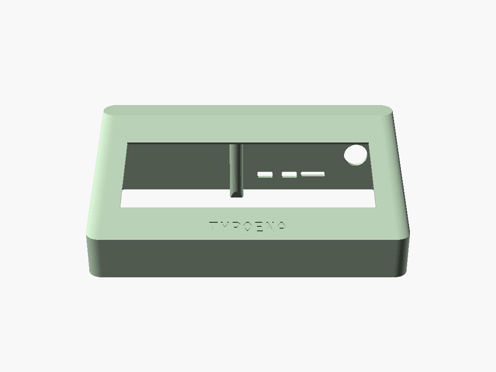

# Enclosure — Typoena body (concept)

A 3D-printable case for [**Typoena**](../../README.md), the distraction-free DIY
writing machine. The e-paper strip sits on a reclined **deck**, where a
typewriter's paper would be; you bring your own keyboard for the front. There is
no platen part (it complicates the print); the rounded back-top edge nods to one.

> **Status: v0 concept, not yet printed.** Outer form, screen retention, and the
> two-board mounting are worked out against the real hardware and render cleanly.
> The one open number is the battery: space is reserved for a **3700 mAh** cell,
> marked `<< MEASURE >>` until one is bought and measured.


## Files

| File                                     | What                                                    |
| ---------------------------------------- | ------------------------------------------------------- |
| [`typoena-case.scad`](typoena-case.scad) | The parametric model. All dimensions live at the top.   |
| [`typoena-case-kb.scad`](typoena-case-kb.scad) | Integrated-keyboard variant (60%/40%) — see [README-kb.md](README-kb.md). |
| [`concept.html`](concept.html)           | Dimensioned side/front/top drawing (open in a browser). |
| `renders/`                               | PNG previews (regenerated by `just render`).            |
| `*.stl`                                  | Committed mesh exports (regenerated by `just stl`).     |

## Render

Needs [OpenSCAD](https://openscad.org). From `hardware/`:

```sh
just render   # regenerate every case/renders/*.png
just stl      # export every STL: body / bracket / baseplate / coupon / assembly
just stl-io   # re-export just the back-wall I/O fit coupon (quick test print)
just stl-feet # export the stick-on feet (deferred — see feet_mode)
just open     # open the model in OpenSCAD
```

`show` accepts `assembled` · `body` · `bracket` · `baseplate` · `feet` ·
`print_plate` · `section` (vertical cut) · `plan` (exploded horizontal) ·
`plan_up` / `plan_down` (each half alone) · `io_coupon` (the I/O fit test print).

## Dimensions

Baked into the model from the datasheets:

- **Panel (GDEY0579T93):** glass 150.92 × 56.94 × 1.0 mm, active area
  139.00 × 47.74 mm, pitch 0.1755 mm.
- **PCB 1** (50 W × 70 D mm): ESP32-S3 devkit + e-ink driver + MT3608 5 V boost;
  ~10 mm stack, ~22 mm at the vertical F-F Dupont rows. Ø2 hole each corner.
  Stands with its **long axis front-back**, FPC end forward.
- **PCB 2** (80 W × 20 D mm): µSD + two USB-C (charge, keyboard) + TP4056 charger;
  connectors overhang the board edge by 8 mm. Ø2 hole each corner.
- **Battery:** LiPo 3700 mAh, 96 × 33.5 × 10.3 mm, flat in the front-right.
- **Body:** 176 W × 104 D, 26 mm front → 60 mm back, deck reclined ~21°. Walls
  2.4 mm, deck 2.6 mm, corner radius 8 mm.

## How the hardware goes in (glueless)

No glue on the fragile 1 mm glass; every part stays serviceable.


**Screen.** The glass drops into the deck recess from behind (the walls locate it
in X/Y). Front to back the stack is: deck **bezel lip** (covers the inactive
border only, `lip_t = 2.4 mm`) → **glass** → non-adhesive closed-cell **foam**
gasket (`foam_t = 5 mm` free, squashed to `foam_c = 3.5` — a 30% squash) → printed
**bracket**
screwed to 4 bosses. The lip stops the glass falling out the front; the bracket
stops it dropping into the cavity. The FPC folds back through an internal
clearance on the **left** (kept under the bezel, so invisible outside) to PCB 1's
driver. For a screwless build, cantilever clips work but point-load the glass
edge; I'd default to foam + bracket.

The bosses' **free ends are the bracket's seating face** (`br_seat = 6.9 mm` below
the deck's outer face). The screw pulls the bracket onto that shoulder and stops,
so the foam squash — and therefore the clamp on a brittle panel — is set by
geometry rather than by how hard you turn the screwdriver. That is also why the
foam is 5 mm and not 1: the seat has to sit far enough behind the glass to leave
the boss room for a **heat-set insert** (see *Fasteners* below). The bore stops
`pilot_skin = 2.0 mm` short of the deck's outer face, so nothing shows on the side
the user looks at — and that skin, not the thread, is what set `lip_t`.

Locating tolerances, once the printer's `print_bloat` is taken off: the pocket
gives the glass **0.25 mm of play per side** in X and Y, against a window margin
of 1.00 mm (X) / 0.50 mm (Y) over the active area — so a drifted panel shifts the
bezel by a quarter of a millimetre and can never clip a pixel. Both numbers derive
from `print_bloat`, so a mis-calibrated extruder moves them together. Don't try to
make the bracket locate anything either way: its clearance holes are **Ø3.9 on a
Ø3.5 shank**, deliberately sloppy. The pocket locates, the bracket only clamps.


**Fasteners.** Everything that screws into the **body** uses one family: a
**ruthex RX-6-32×3.8** brass heat-set insert (Ø5.4 flange / Ø4.7 body, 3.8 long,
datasheet bore **Ø4.8 × 4.8 min**, **1.8 mm minimum wall**) taking a **#6-32** pan
screw — 7 mm of thread under a flat 1 mm × Ø6.5 head. Both parts are measured, not
catalogue numbers. These are the two joints that get *opened*: the baseplate on
every service, the bracket on every glass swap, and a self-tapped thread in PLA is
good for a handful of cycles before it's a stripped hole in a 10-hour print.

| | bracket → deck (×4) | baseplate → body (×3) |
| --- | --- | --- |
| boss | Ø8.9 (was Ø6.8), **1.8 mm** of wall | rectangular pad, **2.35 mm** to the free faces |
| bore | Ø4.8 × 4.9 blind, **2.0 mm of deck** left over it | Ø4.8 × 7.1 blind, 2.9 mm of roof |
| screw crosses | 3.6 mm of bracket | 1.4 mm of plate |
| thread in brass | **2.9 mm** | **3.8 mm** (the whole insert) |
| head | bears on the bracket, inside the case | in a **lamage** in the plate's underside, flush with the desk |

(Wall figures are the *modelled* ones, taken off the modelled bore — the bore
prints ~0.5 under and the boss ~0.5 over, so the real part has ~0.25 mm more a side
than the table claims. The asserts check the pessimistic number.)

Both bores get a **Ø5.8 × 0.5 flange relief** at the mouth: a flange that stops
proud holds the mating part off its seat, and that would spend the foam preload or
rock the plate. The bore is deliberately *deeper* than the insert (it has to take
the screw tip), so **the flange relief is the only stop** — press until the flange
bottoms and the face is flat, and don't chase depth by feel.

The **PCBs are not in this family.** They screw *down* into the baseplate, whose
standoffs are 3 mm tall — nowhere near an insert's 4.8 mm bore, and growing them
would spend the 2.75 mm of ceiling over PCB 1's front edge that the body's +2 mm
was bought to get. They stay **M2 self-tappers into Ø1.6 pilots**.

The depth budget is why `lip_t` went 1.4 → 2.4 and `bracket_t` 2.6 → 3.6. Between
the bracket's seat and the deck's *outer face* there is only `br_seat`, and the
bore eats it from below: 6.9 = bore 4.9 + skin 2.0. At the old numbers that sum came
to 5.9 against a `br_seat` of 5.9 — the bore would have surfaced **exactly** on the
machine's showpiece face, with the screw tip arriving there and the iron melting
brass into it. There is nowhere else to buy that skin, so it came half from
the visible lip (a deeper bezel well) and half from the invisible bracket, and the
glass ends up 1 mm deeper in a stiffer clamp. `typoena-case.scad` **asserts** the
walls, the skin, the roof and the thread engagement — a plausible-looking edit to
any of those four numbers fails the render instead of the print.

**Boards.** Mount everything to the **baseplate** on the bench, then close from
below.

- **PCB 1** back-left on low printed standoffs (`standoff_h = 3`, M2 self-tap into
  `pcb1_holes`), **turned so its long side runs front-back** (x 4…54, y 26…96).
  That orientation is what gives the screen ribbon a run: the board's FPC end sits
  at the **front-left**, right under the front end of the deck slot (which reaches
  y ≈ 27), and the front-left corner ahead of it — 56 × 24 mm of floor, open to
  the deck — is the **flex plenum** where the 100 mm extension's slack lives. The
  header side lands on the board's **back** edge, so the ~22 mm Dupont rows stay
  under the high rear of the wedge and the ribbon to PCB 2 stays short.

  The board's **front edge is the tightest spot in the cavity**, and it is what
  set the body's height. Turning the board moved it out of the tall rear into the
  shallow front and cut the clearance over it from 8.5 mm to **0.75 mm** — positive,
  but no margin at all, and the ~22 mm figure is the loosest measurement in the
  model (how tall the F-F Dupont rows stand depends on how they seat). So `Hf`/`Hb`
  carry **+2 mm** over the original 24/58: the ceiling is now 30.35 mm there and a
  22 mm stack on 3 mm standoffs clears by **2.75 mm**.

  That pair moves **together** on purpose. `theta` is their difference over the
  pillar span, so a matched shift translates the deck plane vertically and leaves
  the recline (21.12°), `deck_L`, `screen_cy` and the whole screen clamp untouched —
  the only visible cost is a machine 2 mm taller at both ends. Raising `Hf` alone
  would have flattened the deck by ~1°. `standoff_h` still can't grow and the tall
  rows still belong at the back edge; the +2 is margin, not permission.
- **PCB 2** back-right along the back wall (`pcb2_holes`); connectors poke out
  through the back-wall ports (`port_x` / `port_z`). From the right-wall end in:
  power switch, µSD, keyboard, charge.
- **Power on/off switch** — a latching push button (push-on / push-off) through
  the back wall (`pwr_*`), Ø13.5 barrel, centre **20 mm in from the right outer
  face** (`pwr_inset`). It breaks the battery-side power feed, so the machine is
  genuinely off between sessions instead of draining the LiPo; it sits clear of
  the typing path. It is a **loose part wired back to PCB 2**, not mounted on it.

  At Ø13.5 it cannot sit beside PCB 2: the board runs to x ≈ 167.6, leaving only
  6 mm to the right wall, and the one clear X band is the board gap. Turning PCB 1
  widened that gap from 13.6 to 33.6 mm without helping — the back-centre baseplate
  boss sits in the middle of it and leaves 12.3 mm a side, still under Ø13.9. So
  the barrel flies **over** the board, and the gap underneath is deliberate
  headroom for parts PCB 2 doesn't carry yet: `pwr_z` reserves `pwr_clear = 4 mm`
  above `pcb2_h`, which leaves **10.4 mm of build height free above the board
  face** across the button's footprint. The driver is `pwr_body_d` (nut across
  corners / body OD, 14 mm measured), *not* the barrel Ø: the nut is the widest
  thing behind the panel and therefore the part that reaches lowest.

  No reset/BOOT button is exposed (S3 auto-download makes both recovery-only);
  like the ESP32's own USB-C they're reached by opening the case.

  `pwr_inset` has **~5 mm of travel left**, and the limit is the nut's flat seat,
  not the hole: the back face is planar only to x = 168 (`W - corner_r`), so the
  Ø14 nut runs off the corner blend below an inset of ~15. Not worth spending —
  it buys gap to the µSD that nothing can see, and the nut already seats on flat
  wall at the default 20.


- **LiPo** flat in the **front-right** in baseplate cage nibs (foam/VHB does the
  rest) — the void inside the **L** the two boards make, PCB 1 down the left and
  PCB 2 across the back. The shallow (26 mm) front of the wedge is dead space the
  tall board stack can't use, and **3700 mAh is the biggest flat cell that fits it**
  (96 × 33.5 × 10.3); the heaviest part up front also keeps the centre of gravity
  low and forward. The latching power switch keeps that capacity from bleeding
  between sessions.

  It is **not centred on the case** — the front-left corner it used to cross is the
  flex plenum, and that is the point of the layout. X is boxed in both ways: PCB 1's
  edge at 54 and the front-right screw boss's free face at 160.0 leave a 106.0 mm
  band for a 96 mm cell, so the **6 / 4.0 mm either side is all the slack there
  is** — a fatter cell has to come out of the plenum or out of `W`. (It was 4.5:
  `post_pad` grew 0.5 to keep 2.35 mm of wall around the insert bore.)
- The baseplate screws up into **three bosses** (two front corners + one in the
  back gap between the boards; the back corners are taken by the standoffs). Each
  is a rectangular pad **fused into the walls it sits against** — the box in
  `post_box` is driven straight through the shell and `body_outer()` trims it
  flush, so the fusion can't drift when `wall` or `corner_r` moves. They start at
  `bp_t` so the plate seats *under* them; the 2.6 mm void that leaves is the
  plate's own volume, and the boss's first layer bridges off the wall. They are
  only `post_h` = **10 mm** tall: the walls carry the boss, so height is purely
  about clearing the Ø4.8 × 7.1 insert bore with a roof left on it. Running them
  to the deck was 67% more plastic propping nothing the walls weren't already
  carrying. The insert goes in from **below**, into the boss face the plate seats
  against — the iron reaches it straight down through the open bottom of the shell,
  so press all three *before* any board goes in. The **back** post sits 7.5 mm off
  the wall's inner face (was 6): the plate has to keep ≥3 mm of rim outboard of the
  Ø7.4 lamage for the head to pull against, and at 6 that rim was 1.55 mm. A
  **cable relief** notch lets the keyboard cable exit and route to the front.


**Assembly order.**

0. **Press the 7 inserts first, on the bare body**: 4 into the bracket bosses under
   the deck, 3 into the baseplate bosses (from below). Iron at ~250 °C, straight
   in, stop when the flange bottoms in its relief and the face is flat. The
   bracket four point at the deck's visible face with 2 mm of PLA behind them —
   these are the ones to go slowly on.
1. Lay glass into the deck recess, add foam, screw the bracket to the 4 bosses
   (#6-32 × 7). Drive them until the bracket sits flat on the boss shoulders and
   stop — the shoulder is the stop, not the foam.
2. Screw PCB 1 (back-left, FPC end forward) and PCB 2 (back-right) to the
   standoffs; set the LiPo into its front-right nibs.
3. Connect the FPC through the slot into PCB 1's front-left end, and coil the
   extension's slack into the front-left plenum; run the PCB 1 ↔ PCB 2 ribbon and
   the battery leads to the charger.
4. Screw the baseplate up into the three bosses.

## Tune first

- **`Hb` (back height) → deck angle.** 18–22° is typewriter-shallow; raise toward
  ~28–35° if the screen reads too edge-on when sitting close.
- **`<< MEASURE >>` items:** the battery dims (`bat_*`) once bought, and
  `active_off_x/y` (the active area sits off-centre in the glass). Board/port
  numbers (`pcb1_*`, `pcb2_*`, `port_*`, `pwr_*`) are already set to the hardware.

## Print notes


- Material PLA/PETG. Body in matte **sage** (`#B6CEB4`), bracket/base in cream or
  brass — the two-tone reads "typewriter" for a filament swap.
- To make the recessed `TYPOENA` engrave read: a swipe of paint pen in the recess,
  or a 3–4 layer filament swap across the nameplate band mid-print.
- 2.4 mm walls + open bottom keep material low.
- **Print the I/O coupon first.** `just stl-io` exports `io-coupon.stl` — a flat
  slice of the real back wall carrying only the four openings (2× USB-C, µSD,
  power button) at their real spacing and wall thickness. Print it face-down (no
  support, ~45 min), dry-fit the connectors, the card and the switch, and adjust
  `usbc_*` / `sd_*` / `pwr_fit` before committing to the body print. At 45 minutes
  a round it is not a guess-and-reprint loop: caliper the parts, then size the
  openings loose (`port_fit`) so one print clears.


- Print body deck-up (or on its back) for little/no support; bracket and baseplate
  print flat. Nameplate font is set by `name_font` (current: **Monaspace
  Krypton**, `brew install --cask font-monaspace`; run `fc-cache -f` so the CLI
  finds it).
- **No feet on this version** (`feet_mode = "none"`). They are modelled and can
  come back as their own part with `feet_mode = "separate"` + `just stl-feet` —
  four Ø14 × 3.5 discs, the front pair concentric with the screw bosses and bored
  at the lamage Ø so a **driver** still reaches the recessed head (a shank-sized
  hole would put it out of reach and the plate could never come off). What they must *not* go back to
  is `"fused"`: hanging off the plate they leave it resting on four small discs,
  turning the whole baseplate into a 3.5 mm overhang that wants support across its
  footprint, standoffs and nibs floating above it. As it stands all three parts
  print flat-face-down with every feature growing upward off the bed — no support
  anywhere.



## Open questions / TODO

- [x] GDEY0579T93 active-area **offset** — measured. Borders 9.0 left (FPC side) /
      2.0 right / 4.0 top / 4.0 bottom, so `active_off_x = 3.5`, `active_off_y = 0`.
      The wide border on the FPC side is the usual COG-on-flex layout.
- [x] **Window centred on the deck** (`glass_dx`). The glass carries the 3.5 mm
      offset instead of the window, so the image sits on the machine's centreline
      rather than leaving a 21 mm bezel against a 14 mm one. It only
      fits because the bracket's left arm was trimmed (`br_ml = 5.5` against
      `br_m = 9`) and its left boss pair pulled inboard (`boss_x_l = -77`): at the
      old symmetric layout the bracket overshot the left wall by 2.6 mm. Verified
      on the built geometry — bracket X 3.54..168.96 and bosses X 4.10..168.86 in
      a 2.40..173.60 cavity, so 1.14 mm at the tightest point (0.64 mm once the
      printer's bloat grows the bracket and shrinks the cavity). The frame is
      sized off the glass rather than off the pocket, so `glass_gap` no longer
      drags the left arm toward the wall.
- [x] Real board mounting-hole + port coordinates — done (two-PCB build).
- [x] Measure the **LiPo** — confirmed 96 × 33.5 × 10.3, `bat_*` unchanged.
- [x] Measure the **power switch** — widest-behind-panel 14 mm (`pwr_body_d`).
- [x] **Port openings sized off the parts.** The first coupon jammed because the
      whole block came off the USB-C spec sheet — `usbc_h` 2.5 and `usbc_w` 8.0 are
      the *plug* envelope, and `sd_w` 13.0 was the same kind of guess. Calipered:
      USB-C shell 8.5 × 2.75–3.0, µSD cage 14.0 wide, and the cage bottom sits
      1 mm *above* the shell bottoms (`sd_rise`) where the model had them level.
      With 1.2 mm of slack on every port opening (`port_fit`) that gives USB-C
      9.7 × 4.2 and µSD 15.2 × 3.2. Dry-fitted on the second coupon: everything
      goes in, USB-C the snuggest of them. The switch keeps its own, smaller
      `pwr_fit` — see below.
- [x] **Port X spacing is measured centre to centre**, 15.5 (charge→keyboard) and
      15.0 (keyboard→µSD) — the only spacing a caliper can reach on a populated
      board. The old edge-gap chain reproduced the USB-C pitch *exactly*, which is
      what confirms `usbc_w = 8.5`, but its 5 mm µSD gap gave 16.25 against a
      measured 15.0: the slot was 1.25 mm too far right, twice the slack that
      could have covered it. Cross-checked: a measured 4.0 mm part-to-part gap against the 3.75 the pitch
      and widths imply — 0.25 mm apart, which is what confirms `sd_w = 14.0` (at
      13.0 the two readings would disagree by a full millimetre).
- [x] **Where the cluster sits on the board** — 7 mm, PCB 2's left edge to the
      charge shell (`chg_gap`), replacing the old chain's 8. The last unmeasured
      link in the block, and the one everything hangs off: it slides all three
      ports together. Centres are now 11.25 / 26.75 / 41.75 off the board edge.
- [ ] **No blanket widening.** Rejected +2 mm on every opening: at a 15 mm
      keyboard→µSD pitch it leaves a 0.55 mm rib between those two, under two
      perimeters in a 2.4 mm wall, so the openings merge instead of printing. The
      rib is 2.55 mm as it stands and that is the number to watch before any
      opening grows again.
- [ ] **One port number still unmeasured:** `sd_h = 2.0`, the cage height. It only
      sets the *top* of the µSD opening now that the bottom is pinned by `sd_rise`,
      so it's the least dangerous of the block — but it's the last datasheet figure
      left in it. The dry-fit also checks the 8/7/5 gaps the X chain trusts.
- [ ] **Confirm `print_bloat` on the coupon.** The machine over-extrudes ~0.5 mm
      on diameter — holes that much small, outer features that much large. Every
      fit in the model now derives from the single `print_bloat` constant, so the
      value is one line to change and nothing else moves. It is still an *estimate*
      off the jammed first coupon: caliper the printed coupon's openings against
      nominal (9.7 × 4.2, 15.2 × 3.2) and set `print_bloat` to the delta
      before committing to the 10-hour body print. Compensation is XY only — Z is
      layer height, and first-layer squish is the slicer's elephant-foot setting.
- [x] **Switch hole settled on the print: `pwr_fit = 0.4`, Ø13.9.** The first
      coupon took the switch perfectly at that hole; the 1.2 that followed printed
      Ø14.7, wider than `pwr_body_d` (14.0, the widest measured feature behind the
      panel), so nothing bore against the wall and the panel stopped retaining it.
      Back to 0.4, and the switch alone is exempt from the `panel_slip +
      print_bloat` slack the ports carry — the printer's bloat is already inside
      that measured 0.4.
- [ ] FPC **reach**: the panel's own ribbon is 20 mm, but the glass back plane
      sits ~38 mm off the floor at mid-deck and PCB 1's top face is at 7.2 mm —
      a ~31 mm drop before the U-turn bend and the lateral run to the driver.
      Solved with a **100 mm FPC extension**. The cavity now reserves the
      **front-left plenum** for it (see PCB 1 above) — 56 × 24 mm of floor open to
      the deck, directly below the slot's front end, and PCB 1's connector is
      confirmed at the **front-left**, so the drop is near-vertical. Two follow-ups
      once it arrives: bench-test contrast *before* printing the body (see below),
      and measure the adapter board to confirm it and the ~60 mm of slack sit in
      there. Also caliper **how far along the front edge** the connector sits: the
      slot spans x 3.5…13.5, so a connector further inboard adds a lateral run
      across the plenum before the drop.
- [ ] **Battery pigtail reach.** The cell sits in the front-right and the TP4056 is
      on PCB 2 at the back — 33.7 mm from the cell's back edge to PCB 2's front
      edge, plus the lateral run to B+/B−, so budget **50–60 mm**. The EEMB 103395's
      JST-PH lead is nominally ~50 mm, which is marginal. If it comes up short, a
      JST-PH extension is the right fix; sliding the cell back (`bat_y0 = 38.1`
      puts it 2 mm off PCB 2) costs the wiring bay and buries 33 mm of tall
      cavity — see the LiPo note above.
- [ ] **Extension contrast risk.** On these COG-on-flex panels the charge-pump
      capacitors live on the driver board and the FPC carries the *generated*
      high-voltage rails (VGH/VGL/VSH/VSL) back to the COG. Added length adds
      resistance on exactly those rails, and the classic symptom is faint or
      ghosty output rather than an outright failure — so it can pass a smoke test
      and still look wrong. Run a full black/white refresh through the extension
      on the bench and compare against the direct connection before the body
      print commits the geometry.
- [ ] **The 7 heat-sets are the one irreversible step on the body print.** The
      geometry is checked (walls, skin, roof and thread engagement are asserted;
      the screw and insert envelopes were booleaned against the solids and come
      back empty), but nothing in the model can hold the **iron**. Two live risks
      on the first body:
      - **Over-pressing the bracket four.** The bore is 4.9 deep for a 3.8 insert,
        so there is ~1.1 mm of slack under a flange that has already bottomed, and
        only **2.0 mm of deck** past that — on the face the user looks at. Press to
        the flange relief and stop; if a first deck dimples or blushes there, take
        `lip_t` up before touching anything else (each +1 is +1 of skin, and the
        only cost is a deeper bezel well).
      - **The screw length is a tape-measure datum.** Bore depths are budgeted at
        `scr_thread_max = 8` against a measured 7, so a 7.5 mm batch is already
        covered; a 10 mm one is not, and on the bracket it would arrive at the
        deck skin. Caliper one screw before driving 4 into the deck.
- [ ] Optional **hinged lid** over the deck (protects the glass in a bag) — called
      for in `docs/hardware.md`, not yet modelled.
- [ ] Feet — **deferred to a later version** (`feet_mode = "none"`). Modelled and
      ready as a separate part. With the heads now flush there is nothing forcing
      them back: the plate sits flat on the desk on its own face.
- [x] ~~**Baseplate screw heads are now the contact points.**~~ Solved by the
      **lamage**: Ø7.4 × 1.2 flat-bottomed, so the flat 1 mm head finishes 0.2
      below the face the machine stands on, with 1.4 mm of plate left over it. The
      countersink this note proposed is the wrong tool for a flat head — a cone
      would touch it on one rim circle instead of its whole underside.

### The panel measurement

Measured borders, glass edge → active area: **9.0 left** (FPC side) · **2.0
right** · **4.0 top** · **4.0 bottom**. From those,
`active_off = (left − right)/2` horizontally and `(top − bottom)/2` vertically,
giving **+3.5 mm horizontal** (toward the right, away from the FPC) and **0
vertical**.

Only the differences are used, so measuring to the visible light window rather
than the true pixel array is fine — the overshoot is symmetric and cancels. The
size itself comes from the datasheet, where it is exact: 792 × 272 px at 0.1755 mm
pitch = **139.00 × 47.74 mm**.

Consequences of the 2 mm right border: the bezel ledge over the glass is
**8.46 mm on the left and 1.46 mm on the right**. That ledge is a step in a solid
deck rather than a free-standing rib, so 1.46 mm prints and holds fine — the
bracket and foam behind carry the clamping load, and the ledge only has to stop
the glass falling forward.
